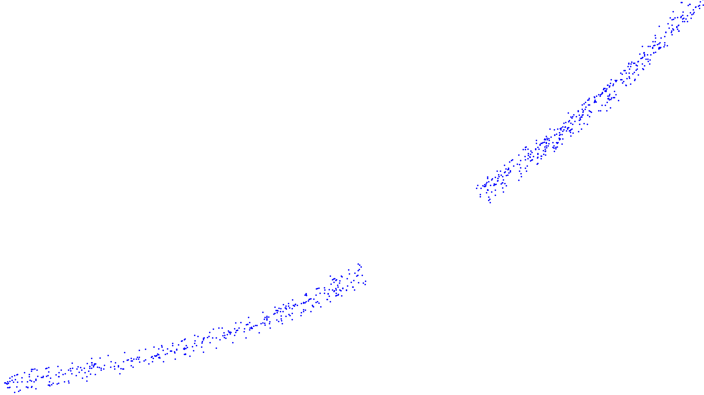
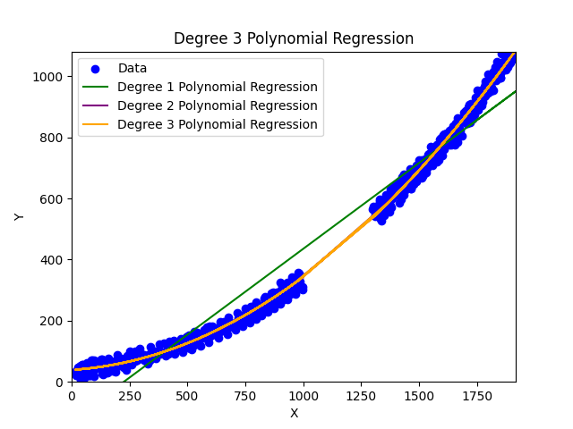

# Script folder

## index.html

This `index.html` is a canvas element that will be used to draw the Cartesian Glide game. You can draw on the canvas using your mouse to create the 2d graph.

Click on save will download the data. You must move it to the `../data` folder.

- `scatter-data.csv` is the data for the 2d graph. `X` and `Y` coordinates are separated by a comma.
- `canvas-data.png` is the image of the 2d graph.

A good 2d graph that will work with a polynomial regression will have a good amount of points and a good spread of points. The more points you have, the more accurate the polynomial regression will be. The graph need to follow a polynomial curve.

Here is an example:

As you can see, this one is missing some data in the middle by design to highlight the power of polynomial regression.

On that diagram you can see that the polynomial regression of degree 2 and 3 are good fits for the data.
