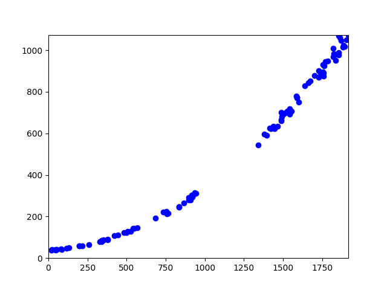

# Solution

Detailed explanation will be provided later.


## Automated Solution

The first step if to gather the data by extraction every information from the AI. The following script save the data to the `extracted_data_from_challenge.csv` file and creates a linear regression of degree 3. This polynomial regression is saved to the `model.pkl` file.

```python
python generate_model.py
```

A plot is also generated to show the data that we have extracted. As you can see, there is a gap in the data. This gap is due to the fact that the AI never choose a value in that range. This is clearly the AI keeping secrets from us to be able to keep it's job. This is why we need to use a polynomial regression to fill the gap.



Once the model is generated, we can use it to get the correct answer to every question send by the AI. The `solve.py` script is looping over the questions and sending the answer to the AI.

```python
python solve.py
```
