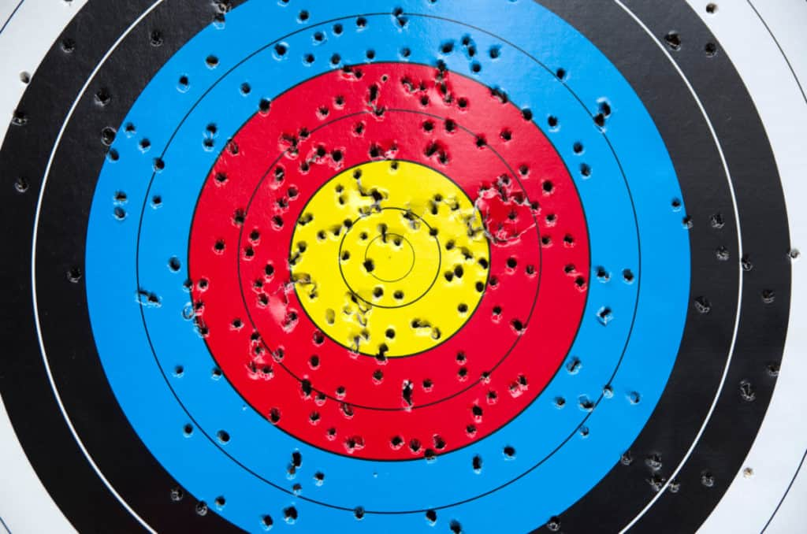

# Stand de tir 1

**`Auteur`** [Bonsoir](https://github.com/florentduchesne)

## Description (français)

Vous venez de trouver votre premier emploi au parc d'attractions (félicitations)!
Après tant d'années d'études, vous êtes finalement arrivé à la conclusion que le marché de l'emploi n'est tout simplement pas ce qu'on vous a vendu. Par chance, d'autres options s'offrent à vous, comme le commerce des chaussons aux pommes ou les emplois étudiants. Grâce à vos contacts, vous avez déniché le nouvel emploi de vos rêves: le poste d'adjoint à la direction des activités d'addresse et de dextérité du parc. En d'autres mots, vous êtes derrière un stand de tir, et attendez patiemment vos premiers clients...
...qui devraient arriver...
...d'une minute...
...à l'autre...

(Soupir)

Vous auriez dû vous douter que quelque chose clochait. Le parc est vide. Votre emploi du temps aussi. Et vous avez oublié votre téléphone à la maison (malheur!).

Comme vous avez un peu de temps à tuer*, vous décidez de faire un inventaire de votre tout nouveau stand. Vous trouvez quelques feuilles de cibles de tir neuves et usagées qui traînent un peu partout. Vous vous pratiquez à quelques reprises sur les feuilles neuves, mais remarquez vite un problème; les différentes zones de chaque cible ne sont pas annotées, il vous est donc impossible de déterminer votre score! Horreur! À quoi bon viser au milieu d'une cible si aucun chiffre n'y est attaché? Vous avez besoin de métriques, il vous *faut* une manière numérique de comparer vos performances à celle du commun des mortels. Sinon, impossible de prouver votre supériorité.

Par chance, en jetant un coup d'oeil plus approfondi aux cibles usées, vous remarquez quelque chose; votre prédécesseur a annoté de nombreux trous avec des chiffres allant de 0 à 10. S'il vous est difficile d'établir une règle générale à l'aide d'un nuage de points, il y a sans doute quelque chose à faire à l'aide de ces données. Peut-être qu'il serait possible de comparer un point à ses plus proches voisins pour déterminer sa valeur?

Pour ce défi vous sont fournis deux fichiers CSV; le premier contient un ensemble de coordonnées 2D auxquelles sont à chacune associée un score. Il s'agit de votre jeu de données d'entraînement. Le second fichier contient uniquement un ensemble de coordonnées. Il s'agit de votre jeu de données d'évaluation. Vous souhaitez évaluer le score de chacune des coordonnées du jeu d'évaluation.

Les coordonnées sont contenues entre zéro et un. Pour ce que vous en savez, l'espace autour de vous vous semble euclidien. Il serait donc adéquat de calculer les distances ainsi.

**\*Aucun temps n'a été blessé durant la rédaction de cette mise en situation**

**Format du flag**: `flag-{[0-9]{20,40}}`

Le flag est une concaténation du score de tous les points du jeu de test dans l'ordre. Par exemple, si votre jeu de test comporte trois points valant 8, 4 et 10 respectivement, votre flag sera `flag-8410`.

**Données d'entraînement**:  
  
**Données de test**:  
  

## Description (english)

You’ve just landed your first job at the amusement park (congratulations)! After so many years of studying, you’ve finally come to the conclusion that the job market is just not what it was made out to be. Fortunately, other options are available to you, such as pastry-making or student jobs. Thanks to your contacts, you’ve found the new dream job: the position of Assistant to the Director of Address and Dexterity Activities at the park. In other words, you’re behind a shooting stand, and you’re waiting patiently for your first clients...
...who should be arriving...
...any minute now...

(Sigh)

You should have suspected that something was wrong. The park is empty. Your schedule is empty too. And you left your phone at home.

Since you have some time to kill*, you decide to take inventory of your brand-new stand. You find a few sheets of new and used target paper scattered around. You practice a few times on the new sheets, but you quickly notice a problem: the different zones on each target are not labeled, so you can’t determine your score! Horror! What’s the point of aiming at the center of a target if no number is attached to it? You need metrics; you must have a numerical way to compare your performance to that of the average person. Otherwise, you can’t prove your superiority.

Fortunately, upon taking a closer look at the used targets, you notice something: your predecessor has labeled many of the holes with numbers ranging from 0 to 10. While it’s difficult to establish a general rule with a scatter of points, there’s surely something you can do with this data. Maybe it’s possible to compare a point to its closest neighbors to determine its value?

For this challenge, you are provided with two CSV files; the first contains a set of 2D coordinates each associated with a score. This is your training dataset. The second file contains only a set of coordinates. This is your evaluation dataset. You wish to assess the score for each of the coordinates in the evaluation dataset.

The coordinates are comprised between zero and one. For all you know, the space around you seems Euclidean. Therefore, it would be appropriate to calculate distances this way.

**\*No time were harmed during the writing of this scenario**

**Flag format**: `flag-{[0-9]{20,40}}`

The flag is a concatenation of the score of all the datapoints from the test set, in order. e.g., if your test dataset has three points worth 8, 4 and 10 points each, your flag should be `flag-8410`.

## Solution

La solution du défi peut être trouvée [ici](solution/).