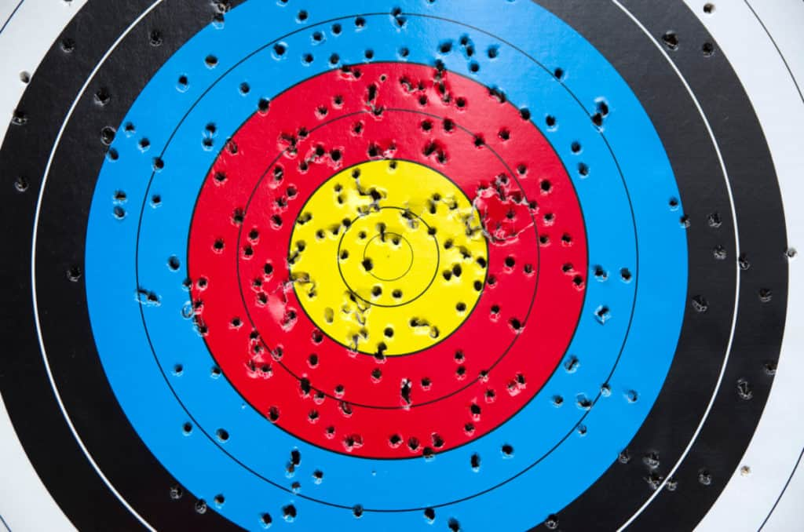
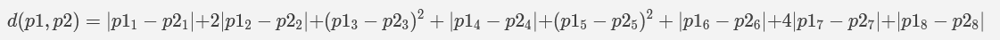

# Stand de tir 3

**`Auteur`** [Bonsoir](https://github.com/florentduchesne)

  

## Description (français)

Après avoir percé le mystère des cibles en 3D (la pognez-vous?), vous regardez un peu aux alentours: pas un chat. Vous continuez donc de fouiller dans vos affaires.
Éventuellement, vous tombez sur des cibles pour le moins étrange. En fait, vous n'avez pas de certitude de bien voir de quoi il s'agit. Une rapide inspection vous apprend que les cibles qui sont devant vous sont en huit dimensions(!). Ce sera compliqué à visualiser, mais le principe est le même que pour les cibles en deux ou trois dimensions. Aussi, il vous semble percevoir quelque chose de différent dans le calcul des distances lorsque vous approchez des cibles. Certaines dimensions se parcourent plus rapidement que d'autres. Il faudra donc ajuster votre fonction de distance adéquatement.

Le challenge est exactement le même qu'au niveau 2, à la différence que l'espace est maintenant en 8D, et que la fonction de distance à utiliser est faite sur mesure.
Elle suit la formule suivante :  
  

**Format du flag**: `flag-{[0-9]{36,72}}`

Le flag suit le même format qu'au niveau précédent. Le jeu de test étant plus gros, le flag devrait toutefois être plus long.

## Description (english)

After unraveling the mystery of the 3D targets, you look around: not a soul in sight. So you continue rummaging through your things.

Eventually, you come across some rather strange targets. In fact, you’re not sure you can *perceive* them properly. A quick inspection reveals that the targets in front of you are in eight dimensions(!). It will be complicated to visualize, but the principle is the same as for the 2D or 3D targets. Additionally, you notice something different about distance calculations when approaching the targets. Some dimensions are traversed more quickly than others. Therefore, you will need to adjust your distance function accordingly.

The challenge is exactly the same as Level 2, except that the space is now 8D, and the distance function to use is custom-made. It follows the following formula:
$$\lvert p1_{1} - p2_{1} \lvert + 2 \lvert p1_{2} - p2_{2} \lvert + (p1_{3} - p2_{3})^2 + \lvert p1_{4} - p2_{4} \lvert + (p1_{5} - p2_{5})^2 + \lvert p1_{6} - p2_{6} \lvert + 4 \lvert p1_{7} - p2_{7} \lvert + \lvert p1_{8} - p2_{8} \lvert$$

**Flag format**: `flag-{[0-9]{36,72}}`

The flag follows the same format as in the previous level. However, since the test set is larger, the flag should be longer.

## Solution

La solution du défi peut être trouvée [ici](solution/).