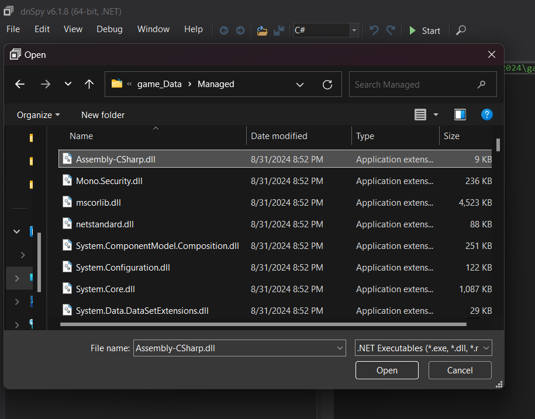
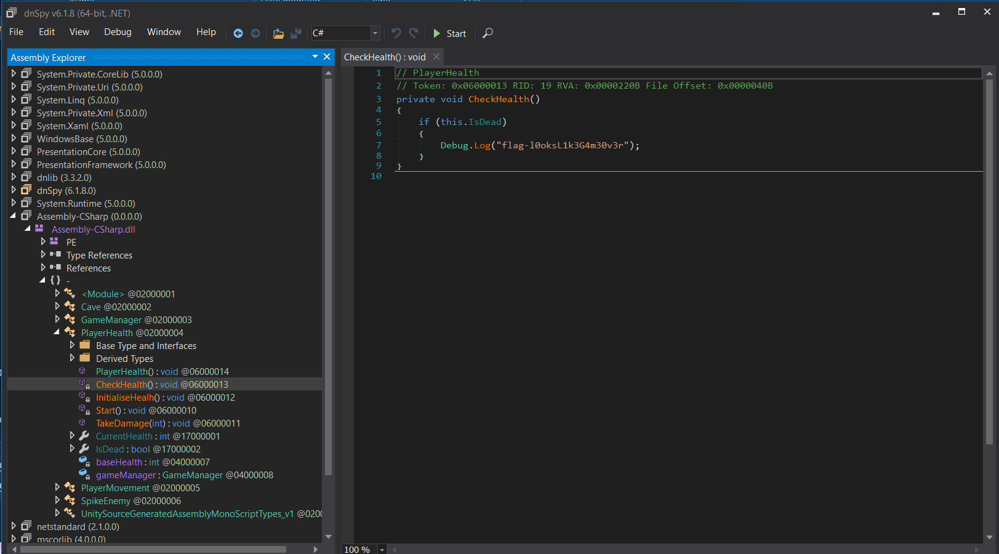

# Lost Game 2

## Write-up

Le flag se trouve directement dans le code donc n'importe quel outil pourvant décombiler des .NET assemblies peut être utilisé. Dans mon cas, je me suis servi de [dnSpy](https://github.com/dnSpy/dnSpy/releases).

Tout d'abord, il faut ouvrir le fichier `Assembly-CSharp.dll`. Ce outil nous permettant par la suite de voir le code source du jeu.

Le flag se trouve dans la fonction `CheckHealth()` de la classe `PlayerHealth`. 

