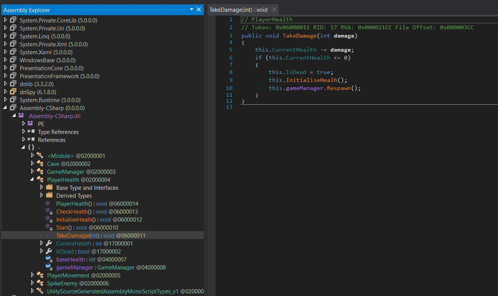
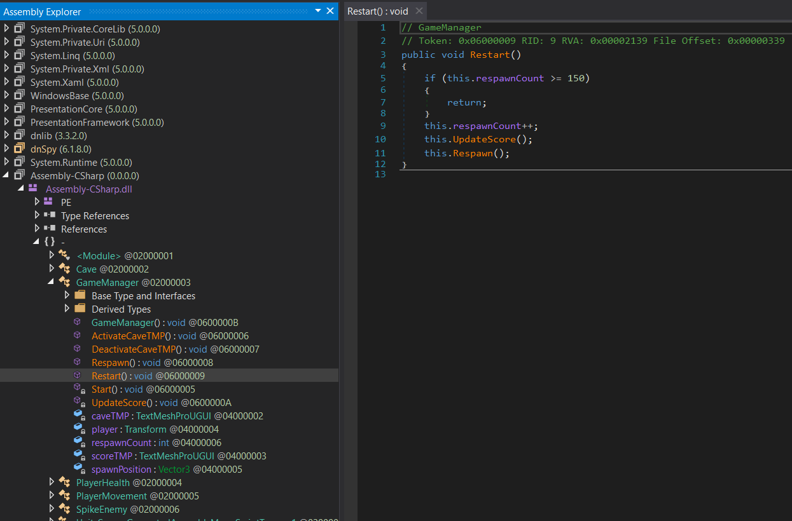
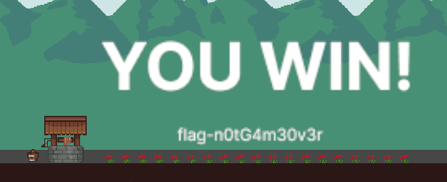

# Lost Game 3

## Write-up

Pour trouver le flag, il faut terminer le jeu. Il est possible de s'y prendre de différentes manières, en voici une d'entre elles : 

Il y a des spikes qui font en sorte que le joueur ne peut pas se rendre à la fin du jeu. Donc, il faudrait commencer par rendre le joueur invencible en pour qu'il puisse se rendre à la fin du niveau. Pour ce faire, la fonction `TakeDamage()` peut être modifiée.

Lorsque le joueur se rend proche de la fin, il est retransporté au début du niveau. Cette action augmente son score, mais il doit avoir un score de 150 pour dépasser cette étape. Lorsque le joueur se rendra à ce pointage, il pourra continuer à avancer et trouvera le flag à la fin du niveau. Le chiffre 150 se trouve dans la fonction `Restart()` et peut être aussi modifiée.

Ainsi, le joueur retrouvera le flag à la fin du niveau.

