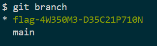

# Branche-toi

## Write-up (français)

Il faut décompresser le fichier `git-gud-challenge.zip` et utiliser l'outil [git](https://git-scm.com/) qui permet de voir entre autre les diverse versions d'un projet.

Le défi parle de branche (nom) et de structure, il est possible de séparer son code avec des branches, pour les voirs:

```bash
git branch
```



## Write-up (english)

You have to unzip the `git-gud-challenge.zip` file and use the [git](https://git-scm.com/) tool which allows you to see among other things the various versions of a project.

The challenge talks about branch (name) and structure, it is possible to separate your code with branches, to see them:

```bash
git branch
```


## Flag

`flag-4W350M3-D35C21P710N`
