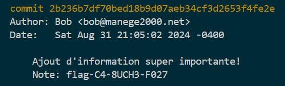

# Bûche

## Write-up (français)

Il faut décompresser le fichier `git-gud-challenge.zip` et utiliser l'outil [git](https://git-scm.com/) qui permet de voir entre autre les diverse versions d'un projet.

En regardant l'historique du travail fait (`commit`) dans la branche `flag-4W350M3-D35C21P710N`, en appuyant de nombreuse fois sur la flèche du bas pour voir de vieux commit tel(`417d9d437cce0d64f5bd233971ebfad4fd418c9d`) qui contient le flag.

```bash
git checkout flag-4W350M3-D35C21P710N 
git log
```



## Write-up (english)

You have to unzip the `git-gud-challenge.zip` file and use the [git](https://git-scm.com/) tool which allows you to see among other things the various versions of a project.

By looking at the history of the work done (`commit`) in the `flag-4W350M3-D35C21P710N` branch, by pressing the down arrow many times to see old commits such as (`417d9d437cce0d64f5bd233971ebfad4fd418c9d`) which contain the flag.

```bash
git checkout flag-4W350M3-D35C21P710N 
git log
```


## Flag

`flag-C4-8UCH3-F027`
