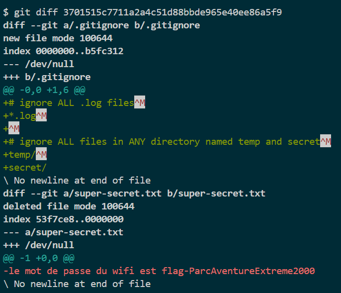

# Ignore ça

## Write-up (français)

Il faut décompresser le fichier `git-gud-challenge.zip` et utiliser l'outil [git](https://git-scm.com/) qui permet de voir entre autre les diverse versions d'un projet.

On peut voir qu'il y a un fichier `.gitignore` qui est la pour ignorer divers dossier et fichier.
Puisqu'en lisant la description on sais que le mot de passe du wifi a déjà été commit, il est possible de regarder les anciens commits, de trouver le commit avec le mot de passe du wifi et de le lire.

on voit un ancien commit avec le message : mot de passe du super wifi et son hash `3701515c7711a2a4c51d88bbde965e40ee86a5f9`

```bash
git log
```


```bash
git diff 3701515c7711a2a4c51d88bbde965e40ee86a5f9
```



## Write-up (english)

We can see that there is a `.gitignore` file that is there to ignore various folders and files.
Since by reading the description we know that the wifi password has already been committed, it is possible to look at the old commits, find the commit with the wifi password and read it.

we see an old commit with the message: super wifi password and its hash `3701515c7711a2a4c51d88bbde965e40ee86a5f9`

```bash
git log
```


```bash
git diff 3701515c7711a2a4c51d88bbde965e40ee86a5f9
```


## Flag

`flag-ParcAventureExtreme2000`
