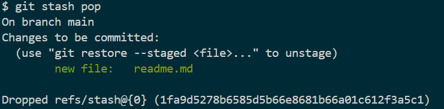

# Presque fini

## Write-up (français)

Il faut décompresser le fichier `git-gud-challenge.zip` et utiliser l'outil [git](https://git-scm.com/) qui permet de voir entre autre les diverse versions d'un projet.

Lorsque quelque chose est pas tout a fait fini, il est possible de le stash. Pour voir le contenue:

```bash
git stash pop
```



Ensuite, en lisant le fichier `readme.md` on voit le flag.

## Write-up (english)

You have to unzip the `git-gud-challenge.zip` file and use the [git](https://git-scm.com/) tool which allows you to see among other things the various versions of a project.

When something is not quite finished, it is possible to stash it. To see the contents:

```bash
git stash pop
```


Then, by reading the `readme.md` file we see the flag.

## Flag

`flag-T0D0-TH3-T0D0`
