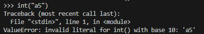

# Guess My Numbers

## Write-up

### Challenge 1
Pour le premier niveau, on voit que la séquence commence avec un nombre de départ et que la différence entre chaque paire de nombres subséquentes est constante.

On peut donc extraire les deux premiers nombres, calculer la différence et calculer le reste de la séquence.

```
Niveau 1: [263, 781, 1299, 1817, 2335, 2853, 3371, 3889, 4407, 4925]
```

Pour le deuxième niveau, la séquence est un peu plus complexe, mais néanmoins assez simple.

On peut constater une multiplication par 10 à chaque 3 nombres et à partir de ce point de repère, on peut voir que les autres opérations sont une addition par une constante et une soustraction par une constante.

Si on extrait le nombre de départ et les deux différences entre les paires de nombres `1,2` et `2,3`, on peut calculer le reste de la séquence.

```
Niveau 2: [468, 1349, 1010, 10100, 10981, 10642, 106420, 107301, 106962, 1069620]
```

Pour le troisième et dernier niveau, on ne voit pas de motif distinct. Cependant, le charlatan mentionne le binaire.

Si on remplace les nombres par leurs équivalents en binaire, on voit que l'opération appliquée est une simple rotation logique d'un bit vers la droite.

Avec le nombre de départ, on peut maintenant calculer le reste de la séquence et obtenir le flag.

```
Niveau 3: [1870245390, 935122695, 2615044995, 3455006145, 3874986720, 1937493360, 968746680, 484373340, 242186670, 121093335]

01101111011110011010111000001110
00110111101111001101011100000111
10011011110111100110101110000011
11001101111011110011010111000001
11100110111101111001101011100000
01110011011110111100110101110000
00111001101111011110011010111000
00011100110111101111001101011100
00001110011011110111100110101110
00000111001101111011110011010111
```

### Challenge 2 (Reloaded)
Pour ce challenge-ci, on n'a pas de séquence de départ, mais on a accès au code utilisé par le charlatan pour générer sa séquence.

En regardant le code, on peut voir qu'il utilise de la génération de nombres pseudo-aléatoires pour créer sa séquence. Cependant, tout n'est pas perdu puisque les données utilisées pour son seed sont soit statiques, contrôlables ou peu volatiles.

De plus, puisque le charlatan nous donne la séquence correcte après avoir échoué, si on peut nullifier la différence dans le seed entre deux essais, on peut correctement deviner la séquence la deuxième fois.

```python
seed = int.from_bytes(socket.gethostname().encode(), byteorder='little') 
# Seed with hostname bytes
seed ^= int.from_bytes(response[:16].encode(), byteorder='little')       
# Throw in some entropy from the user input
seed ^= int(time.time())                                                 
# Throw in the time for good measure

random.seed(seed)
sequence = [random.getrandbits(32) for _ in range(10)]
```

Tout d'abord, avec une recherche dans la [documentation](https://docs.python.org/3/library/socket.html#socket.gethostname) Python, on peut voir que `socket.gethostname` retourne le hostname de la machine sur lequel le code est roulé. Cette variable est donc constante.

Ensuite, le temps est ajouté au seed. Ceux qui ont déjà fait du Python (ou ceux qui ont lu la [documentation](https://docs.python.org/3/library/time.html#time.time)) reconnaitront que `time.time` retourne le temps depuis l'epoch en *secondes* et non en millisecondes. Puisqu'on prend seulement la partie entière du temps, si on agit assez vite, on pourrait obtenir deux fois le même nombre de secondes.

Le dernier obstacle se présente sous la forme des 16 premiers bytes de notre message, qui sont utilisés dans le calcul du seed. Malheureusement, en temps normal, ces 16 bytes contiennent une partie de notre réponse. Le fait de changer notre réponse changerait donc le seed et invaliderait notre stratégie proposée plus haut.

Il faudrait donc trouver une façon de fournir 16 bytes bidon qui ne serait pas pris en compte dans la lecture des nombres.

```python
REGEX_VALIDATION = r"^[^0 \t\v\n\r]*(?:[1-9]\d*|0)$"

def parse_numbers(val):
    if not all([re.match(REGEX_VALIDATION, x) for x in val.split(',')]):
        return None
    return [int(x) for x in val.split(',')]
```

En lisant le code (et en prenant un peu de temps pour comprendre le regex), on peut comprendre que le programme n'accepte que les séquences de nombres délimités de virgules avec des caractères qui ne sont pas des 0, des espaces, des tabs, vertical tabs, des sauts de lignes ou des carriage returns.

Beaucoup de caractères pourraient passer ce filtre, mais ils causent presque tous des erreurs lors de la lecture d'un int.



Pour trouver un caractère fonctionnel, on peut prendre deux approches.

- On peut faire du "fuzzing" (du bruteforce *contrôlé*) pour trouver un caractère qui permettrait la lecture valide d'un nombre en étant préfixé au nombre.
- Alternativement, on peut lire le code source de [CPython](https://github.com/python/cpython) pour trouver le code concerné et identifier un caractère valide.

L'approche du fuzzing est beaucoup plus simple, mais pour des raisons académiques voici le code concerné:

- La fonction de lecture d'un long à partir d'un string: 
https://github.com/python/cpython/blob/92893fd8dc803ed7cdde55d29d25f84ccb5e3ef0/Objects/longobject.c#L2954
- La condition intéressante qui saute des caractères de type "espace":
https://github.com/python/cpython/blob/92893fd8dc803ed7cdde55d29d25f84ccb5e3ef0/Objects/longobject.c#L2967
- La définition de `Py_ISSPACE` (ce n'est qu'un lookup dans la table `_Py_ctype_table` avec un mask `PY_CTF_SPACE`):
https://github.com/python/cpython/blob/92893fd8dc803ed7cdde55d29d25f84ccb5e3ef0/Include/cpython/pyctype.h#L27
- La table en question:
https://github.com/python/cpython/blob/92893fd8dc803ed7cdde55d29d25f84ccb5e3ef0/Python/pyctype.c#L5

Avec ces deux approches, on trouve que `\f` (form feed) est un caractère reconnu comme un espace dans Python et il peut donc être préfixé à un nombre en n'affectant pas sa lecture.

Pour réussir le défi il faut donc:

- Envoyer une séquence bidon préfixée de 16 caractères `\f`
- Récolter la séquence correcte de la part du charlatan
- Renvoyer la séquence correcte préfixée de 16 caractères `\f`

Il se peut que la seconde change entre les deux envois, dans un tel cas, il faut simplement réessayer jusqu'à ce que ça marche.

## Flags
Challenge 1: `flag-L3sM4th5C3s7F4c1l3`<br>
Challenge 2 (Reloaded): `flag-UnP3uD3M4n1pu7ati0nDeRNG`