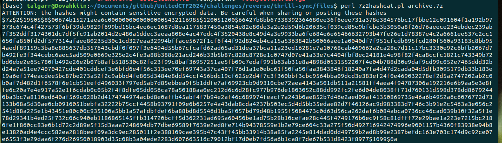
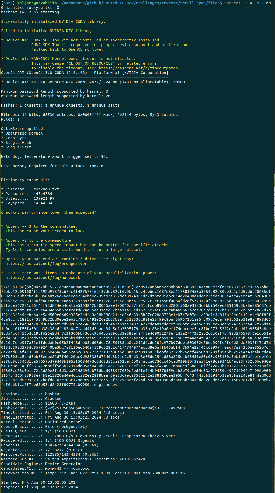
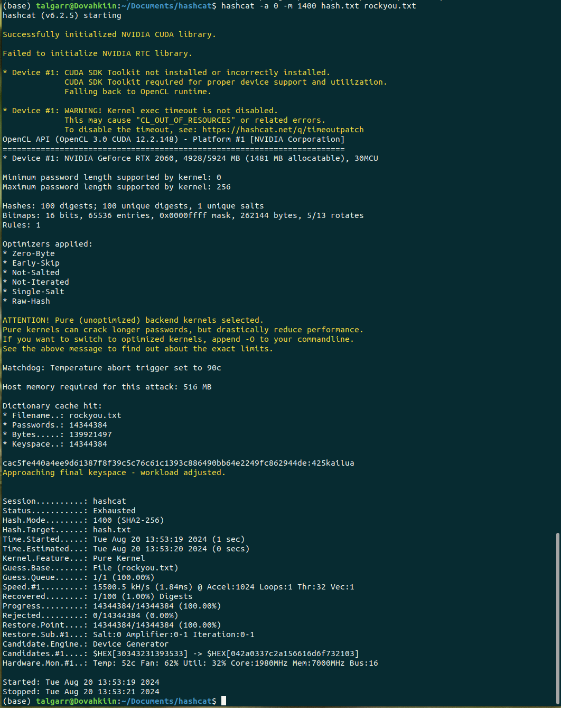

# Solution

## Flag 1

We have an 7z archive which is password protected. We can list the content, which shows the client application in python and a SQLite database:

```shell
7z l data_leaked.7z
```

Since we do not have the password, we can try to crack the password. Using [John utility scripts](https://github.com/openwall/john/tree/bleeding-jumbo/run), more precisely [7z2john.pl](https://github.com/openwall/john/blob/bleeding-jumbo/run/7z2john.pl) or the equivalent for [hashcat](https://raw.githubusercontent.com/philsmd/7z2hashcat/master/7z2hashcat.pl).

```shell
perl 7z2hashcat.pl data_leaked.7z
```



Giving this hash:

```
$7z$2$19$0$$8$00674b15271aea6c0000000000000000$432116985$1200$1200$66427b8bb67338392364680ee36f6eee731a378e384576bc17fbbe12c091604f1a192b97373c674c4f427573f6bf39de9829f699bd15bc4ee6ec1687d8ea1175837450a3854e82e80de3a2e2d59d6b20635cf039cd85e9bfcbe3b3050a8f26d76aeece234ebdec239ab7f352ddf3174301dc7df5fc91ab2014d2e480a1ddec3aeaa808e4ac47edc4f3520438e8c49d4a3e9933ba6fe684e6e65466632793b47fe26e1d78387e4c2a6661ee537c2cc1650fa850fd2df577314afaee80235d30c1cd327eaa32994bfface5672f1cf6f44f92d824eb4ca15a5363842b50066aee1a0040df7f951cfcdb895fcd280f560a93183c8bb954aedf89159c3ba8e885637db357643cbdf0f097f3e6494d55b67cfcafd62ad65ad31dea37bca11a23ed16281e7a10768cab469662a2ca28c7d11c17bc3330e92c6bfb2067d7b492fe3f344cebc6aec5ad509e0669e325e2c4fe3a88b388e21acd246b33b5b87c828c8728e1c0747d07e41a33e7c4404fbf8ec24181e4e98f82f4ca8ccfc1821c743349b72bd0ebe2e65c780fb492e26e2b07b8afb518530c82fe23f99c8baf36957251ae5fb09c7edaf991b63ab31e8a4898d0531552207f4e04b788d30e9daf9cd99c052e7465ddd32bd24a7a51ee74070427cde401cddcef3e6bfd6e4f56c313ee70ef69743a37ca407f76d1a1e0ebc61f50fa50faa3843846f18240a7fa4d47d2cada04d5dfb3095179db33b183e19a6ef174eacdee5bc87be273a52f2c9abbd4fe805d3484e8dd54ccf456bdc19cf625e2d4f7c3f360bbf3cbc9564bba09dcd3e383ef24f0e469032278ef2d5a2747202ab2c0b0af7d482d1f6578f6e1cb51eefd496033f797ed5ab7d85ebbea9f5b1ddfe7af69923cb9d9310cbe72aea4143a501db511a21581ff4aea4f94787306a192216e6b9aa5e3e8ffe6c20a7e4e917a52e1f6cdab0c05b2f4f8dfe05dd056ca78a50188aa0ec212d6c6d28fc977b976de1803052c88dd992fc2fe6d04de8038ff71d760131d598d378dd86792440ba3bc7a8110ed640af569c028b2d4174744974acbd8e0affb45abf4f7b94e2af46c689974feacf7a243b0ae852b7d46e2aed09af41350869735e46a6b4952a6c6076772d73133b08a5d30ae0cb0916051bebfa32222b75ccf4458b93791f09e6b6257e4a43dab8cda4237b503ec5d4d5bb35edae82d7f46126ac9d983383d7f46c3b91e2c5463a3e056c2541d88a225e1b43451e80c00c935100a5bb1a57afdbfdef6ba88bd8d5546d1ba5f057bd79d48b1955f5084473c0d63d56ca262daf6b084abca0736cc46cad039b10f32a5f1e78d29341b4ed25f732c06c940eb1186865145ffb314720bcff5d362231ad695a60450be1ad75b28b10cefae28c445f4749176b0ec9f58c81dfff72e29bae1a223e7215bc2180fe1f860cc83e0b1d72c2d89e5f15d3aaa7248694db77dbe69589f7639e2ed8fe714b94378559e1b2e79ce604c33a275f50d492716942474996e9001157b4360f83938e94b8e13820ad4e4ccc582ea2818beef09a3dc9ec285011f2e388109cae395b47c43ff45bb33914b38a85fa2245e814dad0dd49759b2ad8b99e2387befdc163e703c174d9c92ce07e6553f3e29daa6f276d26950018903d35c08b3a04ede2283d607663516c79012bf17d0eb7fd56a6b1ca8f7de67b531d8423f8977$1099$0a
```

We can then crack it using hashcat. Since it is a slow hash to crack, hopefully it isn't to far in rockyou.

```shell
hashcat -a 0 -m 11600 hash.txt rockyou.txt -O
```



Now we can extract the archive using the password `england4eva`:

```shell
7z x data_leaked
```

## Flag 2

We can read the database using something like DBeaver. We can export the hashes from the database.

```python
import sqlite3

def read_users():
    db = sqlite3.connect("thrill-sync.db")
    sql = "SELECT password FROM users"
    hashes = db.execute(sql).fetchall()
    db.close()
    with open("hash.txt", "w") as f:
        f.write("\n".join([hash[0] for hash in hashes]))

read_users()
```

Identify the hashes:

```shell
head -n 1 hash.txt  | hashid - -m
```

It looks like sha256.

Then try to crack the hash using hashcat and rockyou.txt.

```shell
hashcat -a 0 -m 1400 hash.txt rockyou.txt

cac5fe440a4ee9d61387f8f39c5c76c61c1393c886490bb64e2249fc862944de:425kailua
```



Then we can connect with `ZoeWright:425kailua` and get the flag using the client or `solve_2.py`.

## Flag 3

We can see that the server uses session token to keep track of a logged session. There might be a token that is still valid. Using `solve_3.py`, we try every token and get a hit with d1a76d92c8249969fe955df686e4366ecf01afc5d17107b8367478f447b11023 which is still valid.

## Flag 4

Looking through the hashes and knowing from the challenge description that the server is in PHP, we can see EthanClark hash is a magic hash. If the server uses a loose comparaison between hashes, any password that hash to a magic hash will be valid to login. See https://github.com/spaze/hashes.

This repo has example of magic hash for sha256: https://github.com/spaze/hashes/blob/master/sha256.md

We can then use `solve_4.py` to get the last flag.
