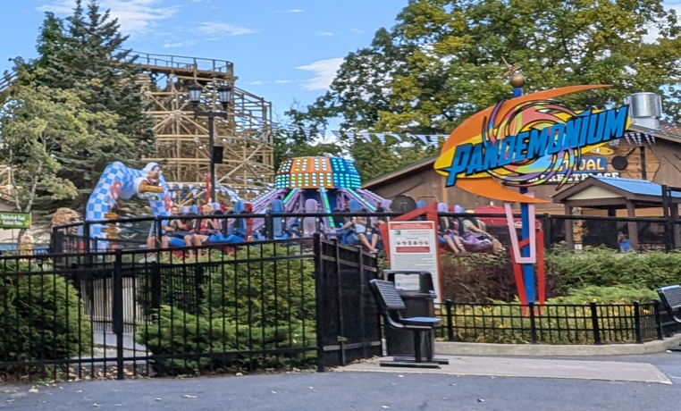
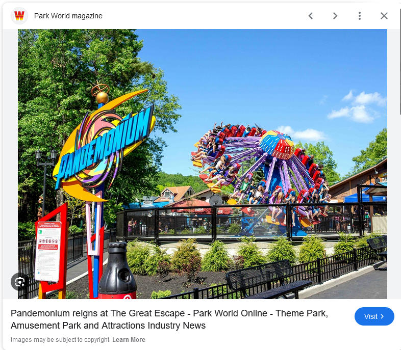
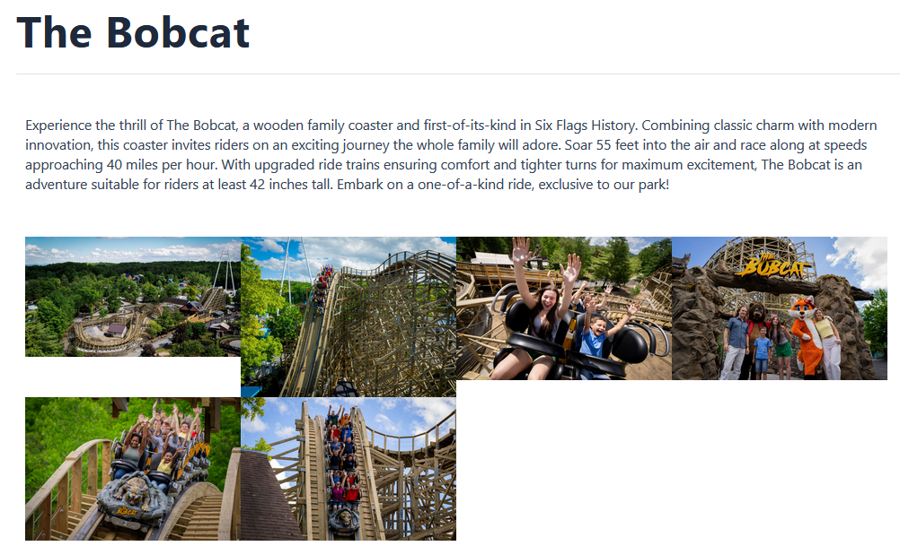

# Fred en voyage 1

## Write-up

En examinant la photo, on peut voir un manège du nom de "Pandemonium" de couleurs bleu, orange et mauve.

Avec un simple recherche sur Google Images telle que "pandemonium amusement park blue orange purple", on trouve des images du manège et on peut voir qu'il appartient au parc Great Escape.

On peut ensuite trouver la [liste des manèges](https://www.sixflags.com/greatescape/things-to-do/all-rides) du parc en ligne. À partir d'ici, on peut trouver la seule montagne russe qui ressemble à celle en bois dans la photo, soit "The Bobcat".

## Flag

`The Bobcat`