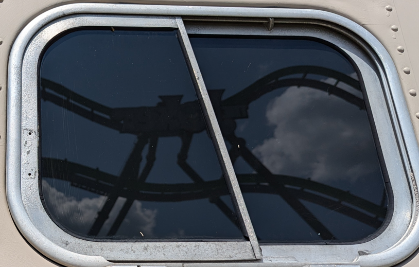
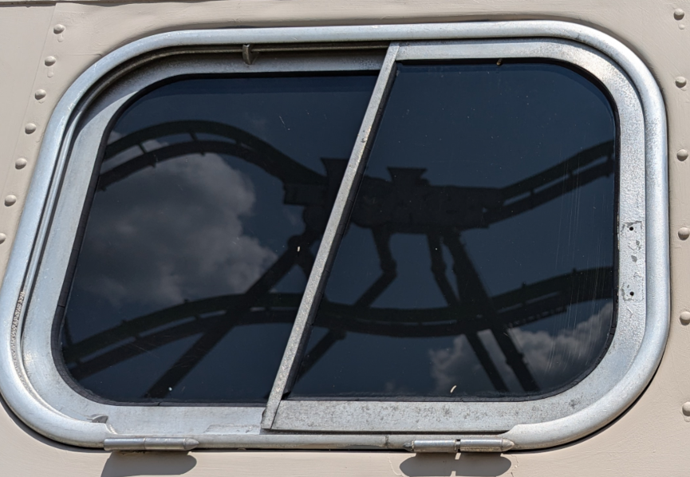
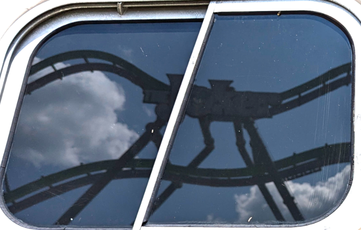
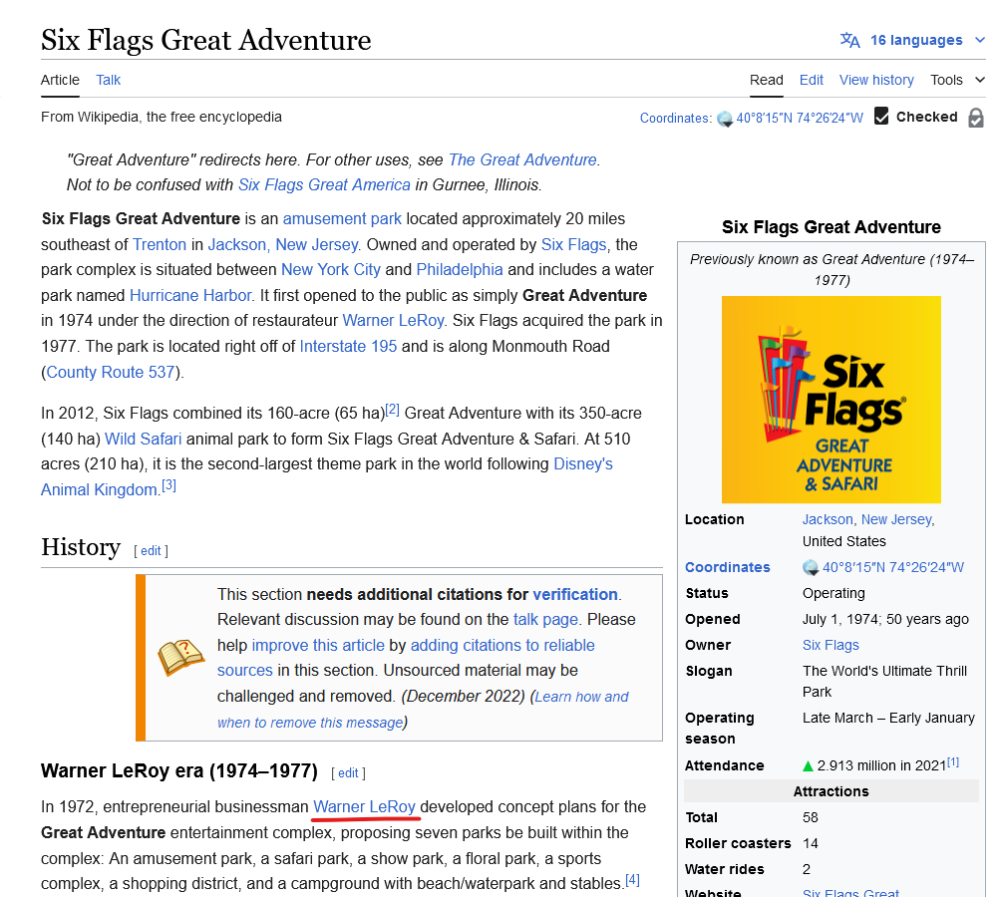

# Fred en voyage 2

## Write-up

En examinant la photo, on peut voir un reflet qui ressemble à du texte dans une des fenêtres.

Puisque c'est un reflet, on commence par faire une réflexion sur l'axe horizontal.

Il est déjà possible de lire le texte, mais on peut jouer avec le contraste de l'image pour le rendre plus lisible au besoin.

On peut maintenant clairement lire "The Joker". Si on fait une recherche sur Google, on peut voir qu'il y a plusieurs manèges et montagnes russes portant le même nom, mais en se fiant au reflet, on peut identifier le manège comme étant celui du parc [Six Flags Great Adventure](https://www.coastergallery.com/1999/Joker_Six_Flags_Great_Adventure.html).

En ouvrant la [page Wikipedia du parc](https://en.wikipedia.org/wiki/Six_Flags_Great_Adventure), on peut trouver le nom de l'homme d'affaires, qui est "Warner LeRoy".

## Flag

`Warner LeRoy`