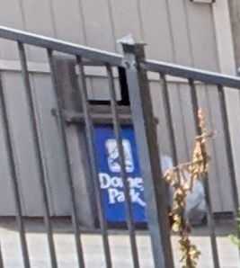

# Fred en voyage 3

## Write-up

En examinant la photo, on peut voir un nom de parc partiel sur une poubelle.

On peut y lire: "Do..e. Pa.k".

On peut facilement déduire que le deuxième mot est Park, mais le premier mot est plus dur à lire.

La police de caractère est un peu stylisée donc on ne peut pas être certain, mais la dernière lettre semble être un y dû à la branche qui descend. (Ça pourrait auss être un X, potentiellement).

Avec ce peu de lettres, on peu trouver le parc sur Google/DuckDuckGo/etc.

Ensuite, on veut trouver le manège dans la réflexion de la vitre. On sait qu'on est près d'un cours d'eau donc on peut trouver la carte du parc et essayer de déterminer où on est.

On peut voir certains ruisseaux/cours d'eau, mais malheureusement [la carte](https://qr1.be/8A3C) est stylisée, déformée et il n'est pas possible de tout voir.

On peut donc essayer de se promener dans street view sur Google Maps, en cherchant un ruisseau, un manège bleu ou une montagne russe rouge (visible dans la flaque d'eau).

Avec un peu de taponnage, on trouve [l'emplacement](https://www.google.ca/maps/@40.580211,-75.5344552,3a,75y,349.48h,95.47t/data=!3m7!1e1!3m5!1sIIaCuHW-c8io04tkndvhDw!2e0!6shttps:%2F%2Fstreetviewpixels-pa.googleapis.com%2Fv1%2Fthumbnail%3Fcb_client%3Dmaps_sv.tactile%26w%3D900%26h%3D600%26pitch%3D-5.4695934407018%26panoid%3DIIaCuHW-c8io04tkndvhDw%26yaw%3D349.47932464791677!7i13312!8i6656?coh=205410&entry=ttu&g_ep=EgoyMDI0MDgyOC4wIKXMDSoASAFQAw%3D%3D) où la photo a été prise.

Une petite recherche révèle que le manège se nomme le "[Demon Drop](https://www.dorneypark.com/rides-experiences/demon-drop)".

Encore une fois, la page Wikipédia du manège nous vient en aide. On peut y lire que le manège était censé être relocalisé à "Knott's Berry Farm" originalement.

## Flag

`Knott's Berry Farm`