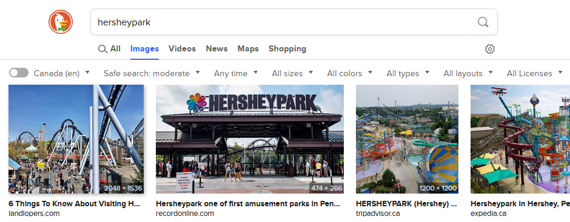
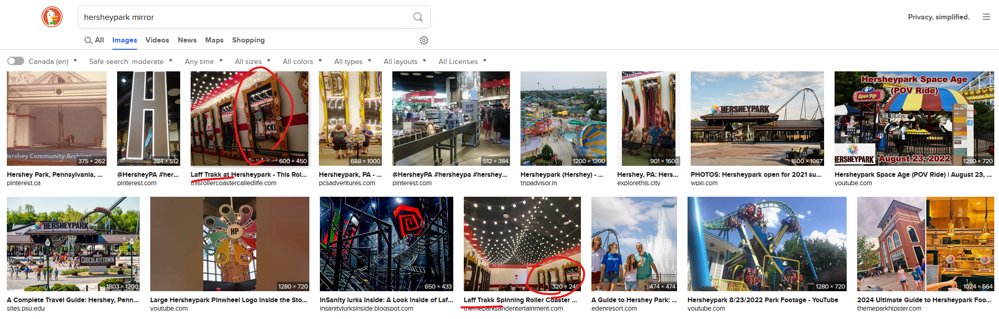

# Fred en voyage 4

## Write-up

Pour ce dernier défi, nous avons très peu de détails. La photo est en angle vers le sol et nous voyons principalement du béton. 
On peut cependant voir un logo partiel sur la poubelle et deux miroirs étranges avec des cadres assez particuliers.

Puisque Fred est en voyage, on peut assumer que le parc dans lequel il se trouve est dans une certaine proximité du dernier.

Le dernier parc était "Dorney Park" dans l'état de la Pennsylvanie. Nous pouvons donc énumérer les parcs en Pennsylvanie pour en trouver un avec un logo similaire.

Avec une recherche sur [Tripadvisor](https://www.tripadvisor.com/Attractions-g28959-Activities-c52-t98-Pennsylvania.html), on trouve quelques parcs tels que:

- Hersheypark
- Knoebels
- Dutch Wonderland
- etc.

Une recherche rapide nous confirme que le parc en question est Hersheypark (par son logo).

Si nous recherchons maintenant "Hersheypark mirror", nous tombons sur le manège en question, qui est "Laff Trakk".

## Flag

`Laff Trakk`