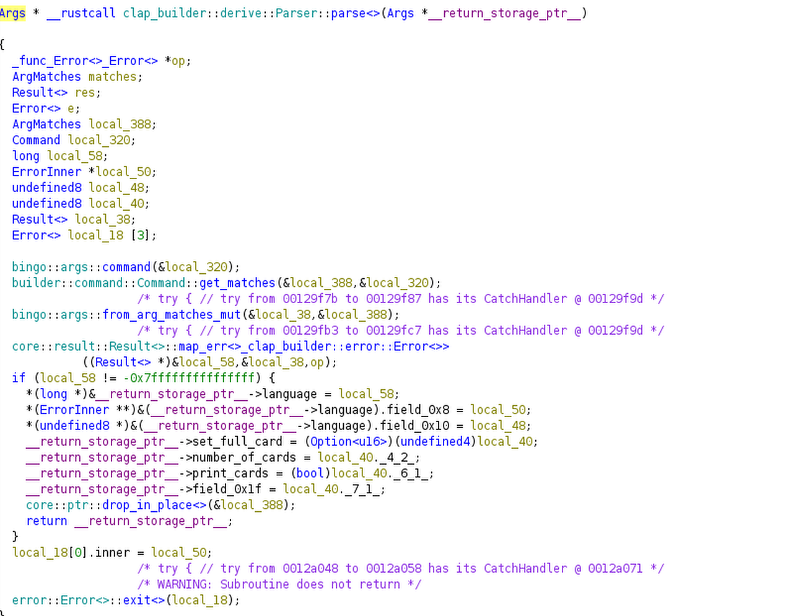
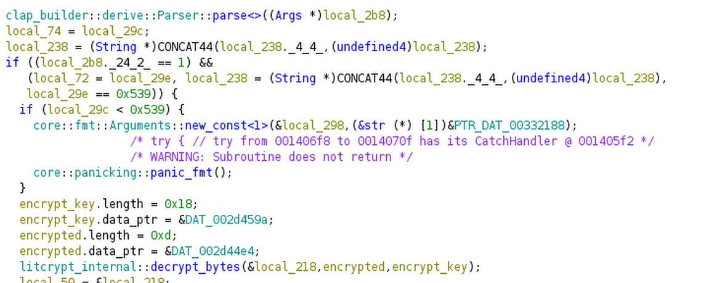
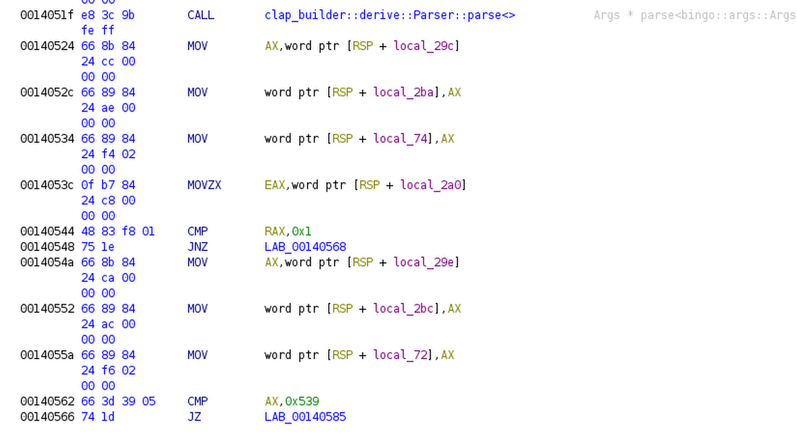
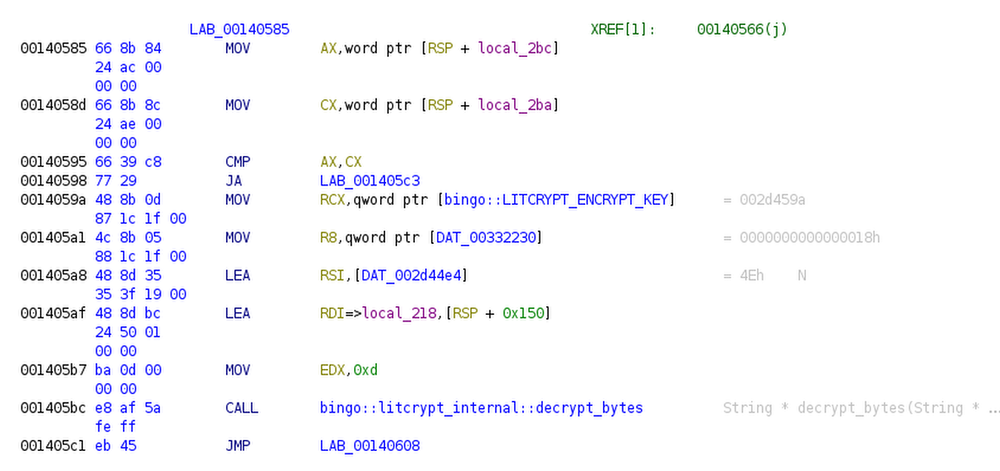
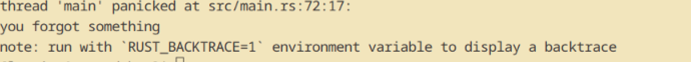
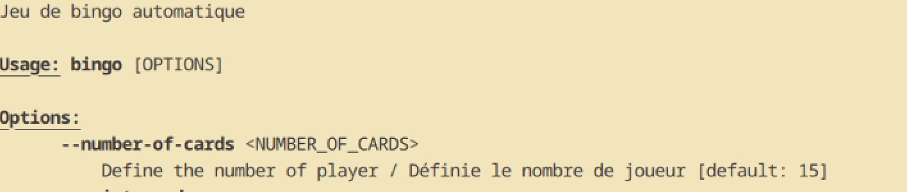
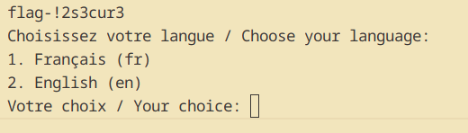
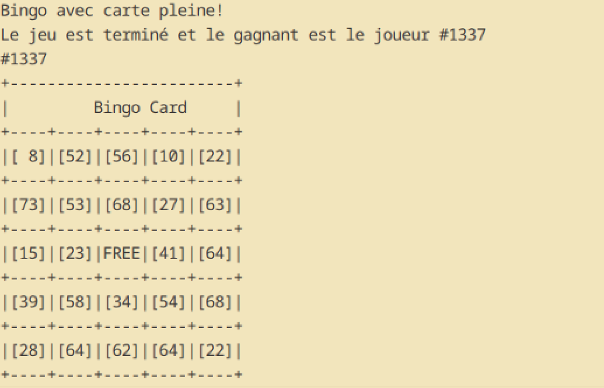

#### Solution

Ils ont accès à la version debug, ce qui rend le challenge réalisable en peu de temps. Il faut savoir lire pour résoudre ce défi. Ce challenge permet de s'initier au concept de backdoor intentionellement induite par le programmeur...réduit à sa plus simple expression.

1. Rendez-vous au main

2 . Voir le parser de clap builder (construit les arguments de la commandline)

3. En fouillant dans le fichier de la fonction on peut voir les arguments de la cli.

il faut donc trigger --set-full-card 

en essayant dans la commandline, le participant comprendra que le flag doit être suivi d'un argument.

En analysant le code source, 

il est plus facile de comprendre avec le code assembleur.

si la comparaison avec 1337 est vrai, on décrypt le flag

**le flag est obfusqué avec litcrypt, le but n'est pas de l'extraire.**

avec ./bingo --set-full-card 1337,

Forcément avec le hint, il a regardé le --help, on peut comprendre que pour faire gagner le joueur 1337, il faut plus de 15 cartes.

donc ./bingo --set-full-card 1337 --number-of-cards 1338 

Proof : 

