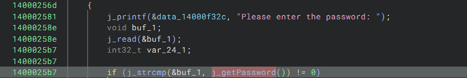
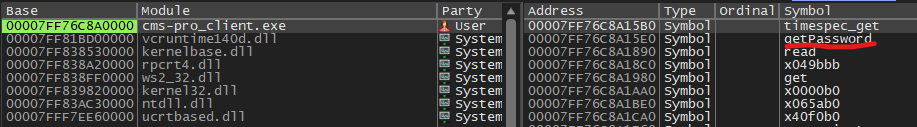
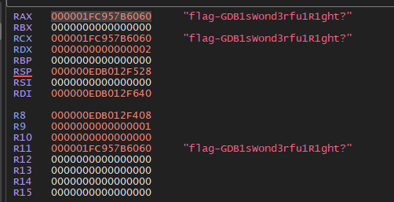

# Clown Management Software 2
## Write-up
### Solution (Français)
Quand on lance le programme, on nous demande le nom d'utilisateur (flag 1) suivi du mot de passe.

Quand on décompile le client, on trouve dans main qu'on demande un input au user, et qu'on le compare avec le résultat de la fonction getPassword.

Dans la fonction getPassword, on remarque qu'une série d'opérations sont effectuées et que le resultat est retourné.

Pour trouver le résultat de la fonction, on peut utiliser un outil comme x64dbg pour débugger le programme.

Dans la tab symbols de x64dbg, on peut voir la fonction getPassword.

Si on double clique dessus, on est amené à l'adresse de la fonction, ou on peut ajouter un breakpoint.

A la toute fin de l'execution de la fonction, on peut voir le flag dans les registers:

flag: `flag-GDB1sWond3rfu1R1ght?`
### Solution (English)
When we run the program, we are asked for the username (flag 1) followed by the password.

When we decompile the client, we find in main that we ask for an input from the user, and that we compare it with the result of the getPassword function.

In the getPassword function, we notice that a series of operations are performed and that the result is returned.

To find the result of the function, we can use a tool like x64dbg to debug the program.

In the symbols tab of x64dbg, we can see the getPassword function.

If we double click on it, we are taken to the address of the function, where we can add a breakpoint.

At the very end of the function execution, we can see the flag in the registers:

flag: `flag-GDB1sWond3rfu1R1ght?`
