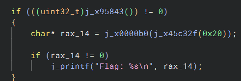

# Clown Management Software 3
## Write-up
### Solution (Français)
Il y a 2 étapes pour obtenir ce flag. 

Dans main on trouve ce segement de code:

La premiere condition compare le resultat de `x95843` avec 0. Si on regarde la fonction `x95843`, on voit qu'elle retourne tout le temps zero:

Donc, on peut simplement patcher le binaire pour inverser la condition.

La premiere ligne dans le bloc de code appelle la fonction x45c32f(0x20). Si on va dans la fonction, on peut voir qu'elle compare l'argument avec 0x40.

Si on patch main pour appeler x45c32f(0x40) au lieu de x45c32f(0x20), la condition est vrai et on peut obtenir le flag après avoir passé le username et password.

Cependant. si on patch x45c32f pour retourner 0x20 au lieu de 0x40, le flag ne sera pas affiché. Dans le return de la fonction, on voit qu'on soustrait x * 64 (<< 6) de 7fffffffffffffff. On voit dans main qu'on appelle x0000b0 avec le retour de la fonction. Dans x0000b0, on voit cela:

Le premier if compare le resultat de x45c32f avec 0x7fffffffffffefff, ce qui est le resultat de 0x7fffffffffffffff - (64 * 64). Donc, si on patch x45c32f pour retourner 0x20, le if sera faux et le flag ne sera pas affiché.

flag: `flag-WQ8TZXL5V7P1BK9QR7ZQ2JPXLMN4V5QW`
### Solution (English)
There are 2 steps to get this flag.

In main we find this code segment:

The first condition compares the result of `x95843` with 0. If we look at the `x95843` function, we see that it always returns zero:

So, we can simply patch the binary to invert the condition.

The first line in the code block calls the function x45c32f(0x20). If we go into the function, we can see that it compares the argument with 0x40.

If we patch main to call x45c32f(0x40) instead of x45c32f(0x20), the condition is true and we can get the flag after passing the username and password.

However, if we patch x45c32f to return 0x20 instead of 0x40, the flag will not be displayed. In the return of the function, we see that we subtract x * 64 (<< 6) from 7fffffffffffffff. We see in main that we call x0000b0 with the return of the function. In x0000b0, we see this:

The first if compares the result of x45c32f with 0x7fffffffffffefff, which is the result of 0x7fffffffffffffff - (64 * 64). So, if we patch x45c32f to return 0x20, the if will be false and the flag will not be displayed.

flag: `flag-WQ8TZXL5V7P1BK9QR7ZQ2JPXLMN4V5QW`

