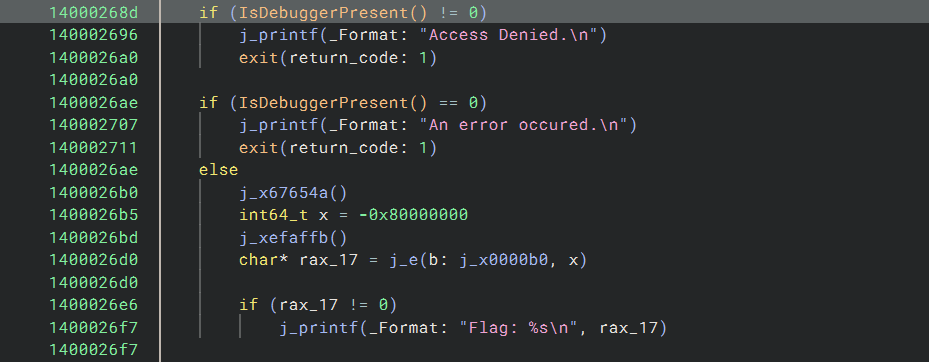
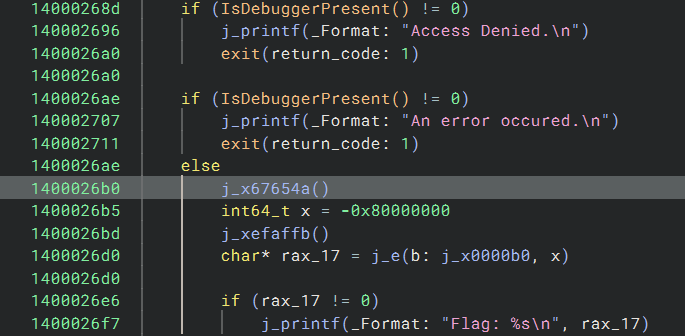

# Clown Management Software 4
## Write-up
### Solution (Français)
Dans la fonction main, on trouve 2 appels a la fonction IsDebbuggerPresent(), qui vont appeller exit() s'ils sont true et false respectivement.

On remarque aussi que le flag est print juste après les conditions, donc on peut simplement patcher le binaire pour inverser une des conditions.

Si on lance le programme, on obtient le flag après avoir entré le username et password.

flag: `flag-Q8T3R6A5ZX7P9JFR2C3DZ8JKR6YA2PXLM`

### Solution (English)

In the main function, we find 2 calls to the IsDebbuggerPresent() function, which will call exit() if they are true and false respectively.

We also notice that the flag is printed just after the conditions, so we can simply patch the binary to invert one of the conditions.

If we run the program, we get the flag after entering the username and password.

flag: `flag-Q8T3R6A5ZX7P9JFR2C3DZ8JKR6YA2PXLM`