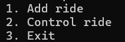
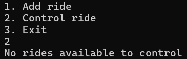
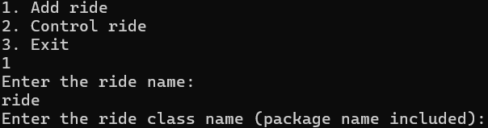
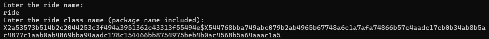
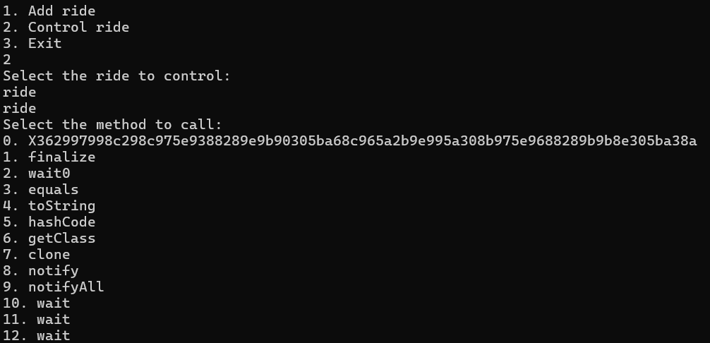

# JavaReverse 6
## Write-up
### Solution (Français)


----
#### TLDR:
En exploitant l'utilisation de la reflexion dans le logiciel on peux créer un object `X2a53573b514b2c2044253c3f494a3951362c43313f55494e$X544768bba749abc079b2ab4965b67748a6c1a7afa74866b57c4aadc17cb0b34ab8b5ac4877c1aab0ab4869bba94aadc178c154466bb8754975beb4b0ac4568b5a64aaac1a5$X1d0a5a19300a304446`.

A partir de cet objet on peut appeller la méthode privée `X362997998c298c975e9388289e9b90305ba68c965a2b9e995a308b975e9688289b9b8e305ba38a` 
pour print le flag.

Flag: `flag-CarefulW1thRef1ec7i0n`

----
Nous avons plusieurs classes qui commencent par `X2a53573b514b2c2044253c3f494a3951362c43313f55494e$`, nous indiquant qu'elles ont été obfusqués par le `ComplexObfuscatorService`.

```java
protected String obfuscate(String text) {
    int depth = 10;
    Base64.Encoder encoder = Base64.getEncoder();
    byte[] key = new byte[depth];
    String b64 = text;

    for(int i = 0; i < depth; ++i) {
        b64 = new String(encoder.encode(b64.getBytes()));
        key[i] = b64.getBytes()[i];
    }

    int[] res = this.xor(text.getBytes(), key);
    byte[] res2 = ((ByteArrayOutputStream)Arrays.stream(res).map((ix) -> {
        return Integer.valueOf(ix + res.length).byteValue();
    }).collect(ByteArrayOutputStream::new, (baos, ix) -> {
        baos.write((byte)ix);
    }, (baos1, baos2) -> {
        baos1.write(baos2.toByteArray(), 0, baos2.size());
    })).toByteArray();
    String var10000 = new String(Hex.encodeHex(res2));
    return "X" + var10000;
}
```

 Parmis elles se trouve `X2a53573b514b2c2044253c3f494a3951362c43313f55494e$X544768bba749abc079b2ab4965b67748a6c1a7afa74866b57c4aadc17cb0b34ab8b5ac4877c1aab0ab4869bba94aadc178c154466bb8754975beb4b0ac4568b5a64aaac1a5$X1d0a5a19300a304446` (Que nous allons appeller `FLAGCLASS`), qui contient la méthode `X362997998c298c975e9388289e9b90305ba68c965a2b9e995a308b975e9688289b9b8e305ba38a` (Que nous allons appeller `printFlag()`).
 
Nous voyons dans cette fonction une variable `encFlag`, et que nous imprimons l'output de `X2a53573b514b2c2044253c3f494a3951362c43313f55494e$X251d2651434f40303014201624524d.X45151e493b4740(encFlag)`. 

```java
private void X362997998c298c975e9388289e9b90305ba68c965a2b9e995a308b975e9688289b9b8e305ba38a() {
    Main.complexObfuscatorService.invokeMethodFromObfuscatedClass(X2a53573b514b2c2044253c3f494a3951362c43313f55494e$X605374c7b355b7cc85beb75571c28354b2cdb3bbb35472c18856b9cd88bcbf56c4c1b85483cdb6bcb75475c7b556b9cd84cd6052c8c8b256b2ccb4bcb25478c7b25685cb88bdc05574c8b656b6cdb4bcb2.class, "X2e239a964f24529b818b54248f8f81214f9a4f887f223f8f83244f9a7f8a54", Boolean.class, null);
    String encFlag = X2a53573b514b2c2044253c3f494a3951362c43313f55494e$X2750423f0f60303e3724334f.X1e6a3c420e5f2f18413622(X2a53573b514b2c2044253c3f494a3951362c43313f55494e$X251d2651434f40303014201624524d.X45151e493b4740(Main.basicObfuscatorService.invokeMethodFromObfuscatedClass(X240d120e4e180a0701375205235c21321c3314593631$X25030f014430.class, "get", String.class, null, X2a53573b514b2c2044253c3f494a3951362c43313f55494e$X251d2651434f40303014201624524d.X45151e493b4740(Main.basicObfuscatorService.invokeMethodFromObfuscatedClass(X240d120e4e180a0701375205235c21321c3314593631$X25030f014430.class, X2a53573b514b2c2044253c3f494a3951362c43313f55494e$X251d2651434f40303014201624524d.X45151e493b4740(Main.basicObfuscatorService.invokeMethodFromObfuscatedClass(X240d120e4e180a0701375205235c21321c3314593631$X25030f014430.class, "get", String.class, null, "c")), String.class, null, X2a53573b514b2c2044253c3f494a3951362c43313f55494e$X251d2651434f40303014201624524d.X45151e493b4740(Main.basicObfuscatorService.invokeMethodFromObfuscatedClass(X240d120e4e180a0701375205235c21321c3314593631$X25030f014430.class, "get", String.class, null, "d")))))));
    System.out.println(X2a53573b514b2c2044253c3f494a3951362c43313f55494e$X251d2651434f40303014201624524d.X45151e493b4740(encFlag));
}
```

Comme on ne peux pas retrouver les noms de classes et fonctions original dû a l'obfuscation, il est difficile de comprendre ce qu'il se passe. 


```java
//Pseudocode de la Ligne 1:
//Main.complexObfuscatorService.invokeMethodFromObfuscatedClass(X2a53573b514b2c2044253c3f494a3951362c43313f55494e$X605374c7b355b7cc85beb75571c28354b2cdb3bbb35472c18856b9cd88bcbf56c4c1b85483cdb6bcb75475c7b556b9cd84cd6052c8c8b256b2ccb4bcb25478c7b25685cb88bdc05574c8b656b6cdb4bcb2.class, "X2e239a964f24529b818b54248f8f81214f9a4f887f223f8f83244f9a7f8a54", Boolean.class, null);
        
SecurityManager.confirmSecurity()
```
Le `SecurityManager.confirmSecurity()` permet de s'assurer que le code qui roule n'a pas été modifié. 

Cette fonction permet de s'assurer que la fonction roule uniqument dans le logiciel, que la signature de la fonction est identique à l'originale et que la classe n'a pas été modifiée.

Cette fonction est là pour compliquer l'obtention du flag et est utilisé un peu partout dans le logiciel. De plus, elle est des fois appellée par la fonction `ComplexObfuscatorService.invokeMethodFromObfuscatedClass()` afin d'amener plus de confusion.

Cela enlève l'option d'appeller la fonction a partir d'une autre classe et nous laisse quelques options:

- Essayer de comprendre comment le flag est encrypté manuellement
- Trouver une façon d'appeller la méthode même si elle est private

```java
//Pseudocode de la ligne 2:
//String encFlag = X2a53573b514b2c2044253c3f494a3951362c43313f55494e$X2750423f0f60303e3724334f.X1e6a3c420e5f2f18413622(X2a53573b514b2c2044253c3f494a3951362c43313f55494e$X251d2651434f40303014201624524d.X45151e493b4740(Main.basicObfuscatorService.invokeMethodFromObfuscatedClass(X240d120e4e180a0701375205235c21321c3314593631$X25030f014430.class, "get", String.class, null, X2a53573b514b2c2044253c3f494a3951362c43313f55494e$X251d2651434f40303014201624524d.X45151e493b4740(Main.basicObfuscatorService.invokeMethodFromObfuscatedClass(X240d120e4e180a0701375205235c21321c3314593631$X25030f014430.class, X2a53573b514b2c2044253c3f494a3951362c43313f55494e$X251d2651434f40303014201624524d.X45151e493b4740(Main.basicObfuscatorService.invokeMethodFromObfuscatedClass(X240d120e4e180a0701375205235c21321c3314593631$X25030f014430.class, "get", String.class, null, "c")), String.class, null, X2a53573b514b2c2044253c3f494a3951362c43313f55494e$X251d2651434f40303014201624524d.X45151e493b4740(Main.basicObfuscatorService.invokeMethodFromObfuscatedClass(X240d120e4e180a0701375205235c21321c3314593631$X25030f014430.class, "get", String.class, null, "d")))))));
        
encFlag = HTTPRequests.post("/thisisandendpointithink")
```

`HTTPRequests` est la classe `X2a53573b514b2c2044253c3f494a3951362c43313f55494e$X2750423f0f60303e3724334f` et elle permet de communiquer avec le serveur HTTP qui est lancé avec notre application.

La majorité du code dans cette ligne permet simplement d'obtenir `"/thisisandendpointithink"` en récupérant des strings du fichier `config.conf` et en les décryptant.

La réponse du POST va être notre string encrypté.

```java
//Pseudocode pour la ligne 4
//System.out.println(X2a53573b514b2c2044253c3f494a3951362c43313f55494e$X251d2651434f40303014201624524d.X45151e493b4740(encFlag));
println(HomemadeEncryption.decrypt(encFlag))
```
Ici nous décryptons le flag et on le print. La partie la plus difficile ici est de comprendre l'encryption. Malheureusement le challenge à été designé dans le but de rendre ça aussi long et fastidieux que possible. 

Voici les étapes pour encrypter le flag:
- ToBase64
- ToBinary(No delimiter) pour chaque caractère
- XOR({0x1})
- ToBinary(No delimiter) pour chaque caractère
- Rot7 pour chaque caractère
- ToDecimal(; as a delimiter) pour chaque caractère
- XOR("rotatethat")
- ToBinary(NoDelimiter) pour chaque caractère
- ToDecimal(" " as a delimiter) pour chaque caractère
- ToBase64
- ToHex

Comme on peut voir avec la multitude d'étapes, cela va nous donner un string extremement long, et quasi impossible à restore manuellement.

Le flag est encrypté avant d'être mis dans le fichier de config. Comme le fichier de config est rempli d'autre strings quasiment similaire, incluant des faux flags, il est difficile d'identifier lequel est le bon.

Lors de l'execution du programme, après avoir entré le numéro de série et le mot de passe (flags trouvés précedemment), nous arrivons au menu suivant:



En choissant l'option 2, nous pouvons controler un manège. Comme aucun manège n'a été ajouté, nous avons le message suivant: 



En choisissant l'option 1, nous pouvons créer un manège. Le programme nous demande d'entrer le nom d'une classe Java:



Nous pouvons entrer un nom pour le manège et entrer notre classe `'FLAGCLASS'` 


Si nous choisissant de nouveau l'option 2 et que nous choisissons le manège que nous avons créé, nous pouvons voir que nous pouvons appeller les méthodes de l'objet:


Nous pouvons voir que la méthode 0 (`'printFlag()'`) est disponnible, malgrée le fait qu'elle est private. En entrant 0, le flag est imprimée.

Flag: `flag-CarefulW1thRef1ec7i0n`
### Solution (English)

----
#### TLDR:
By exploiting the use of reflection in the software we can create an object `X2a53573b514b2c2044253c3f494a3951362c43313f55494e$X544768bba749abc079b2ab4965b67748a6c1a7afa74866b57c4aadc17cb0b34ab8b5ac4877c1aab0ab4869bba94aadc178c154466bb8754975beb4b0ac4568b5a64aaac1a5$X1d0a5a19300a304446`.

From this object we can call the private method `X362997998c298c975e9388289e9b90305ba68c965a2b9e995a308b975e9688289b9b8e305ba38a` 
to print the flag.

Flag: `flag-CarefulW1thRef1ec7i0n`

----
We have several classes that start with `X2a53573b514b2c2044253c3f494a3951362c43313f55494e$`, indicating that they have been obfuscated by the `ComplexObfuscatorService`.

```java
protected String obfuscate(String text) {
    int depth = 10;
    Base64.Encoder encoder = Base64.getEncoder();
    byte[] key = new byte[depth];
    String b64 = text;

    for(int i = 0; i < depth; ++i) {
        b64 = new String(encoder.encode(b64.getBytes()));
        key[i] = b64.getBytes()[i];
    }

    int[] res = this.xor(text.getBytes(), key);
    byte[] res2 = ((ByteArrayOutputStream)Arrays.stream(res).map((ix) -> {
        return Integer.valueOf(ix + res.length).byteValue();
    }).collect(ByteArrayOutputStream::new, (baos, ix) -> {
        baos.write((byte)ix);
    }, (baos1, baos2) -> {
        baos1.write(baos2.toByteArray(), 0, baos2.size());
    })).toByteArray();
    String var10000 = new String(Hex.encodeHex(res2));
    return "X" + var10000;
}
```

Among them is `X2a53573b514b2c2044253c3f494a3951362c43313f55494e$X544768bba749abc079b2ab4965b67748a6c1a7afa74866b57c4aadc17cb0b34ab8b5ac4877c1aab0ab4869bba94aadc178c154466bb8754975beb4b0ac4568b5a64aaac1a5$X1d0a5a19300a304446` (That we will call `FLAGCLASS`), which contains the method `X362997998c298c975e9388289e9b90305ba68c965a2b9e995a308b975e9688289b9b8e305ba38a` (That we will call `printFlag()`).
 
We see in this function an `encFlag` variable, and that we print the output of `X2a53573b514b2c2044253c3f494a3951362c43313f55494e$X251d2651434f40303014201624524d.X45151e493b4740(encFlag)`. 

```java
private void X362997998c298c975e9388289e9b90305ba68c965a2b9e995a308b975e9688289b9b8e305ba38a() {
    Main.complexObfuscatorService.invokeMethodFromObfuscatedClass(X2a53573b514b2c2044253c3f494a3951362c43313f55494e$X605374c7b355b7cc85beb75571c28354b2cdb3bbb35472c18856b9cd88bcbf56c4c1b85483cdb6bcb75475c7b556b9cd84cd6052c8c8b256b2ccb4bcb25478c7b25685cb88bdc05574c8b656b6cdb4bcb2.class, "X2e239a964f24529b818b54248f8f81214f9a4f887f223f8f83244f9a7f8a54", Boolean.class, null);
    String encFlag = X2a53573b514b2c2044253c3f494a3951362c43313f55494e$X2750423f0f60303e3724334f.X1e6a3c420e5f2f18413622(X2a53573b514b2c2044253c3f494a3951362c43313f55494e$X251d2651434f40303014201624524d.X45151e493b4740(Main.basicObfuscatorService.invokeMethodFromObfuscatedClass(X240d120e4e180a0701375205235c21321c3314593631$X25030f014430.class, "get", String.class, null, X2a53573b514b2c2044253c3f494a3951362c43313f55494e$X251d2651434f40303014201624524d.X45151e493b4740(Main.basicObfuscatorService.invokeMethodFromObfuscatedClass(X240d120e4e180a0701375205235c21321c3314593631$X25030f014430.class, X2a53573b514b2c2044253c3f494a3951362c43313f55494e$X251d2651434f40303014201624524d.X45151e493b4740(Main.basicObfuscatorService.invokeMethodFromObfuscatedClass(X240d120e4e180a0701375205235c21321c3314593631$X25030f014430.class, "get", String.class, null, "c")), String.class, null, X2a53573b514b2c2044253c3f494a3951362c43313f55494e$X251d2651434f40303014201624524d.X45151e493b4740(Main.basicObfuscatorService.invokeMethodFromObfuscatedClass(X240d120e4e180a0701375205235c21321c3314593631$X25030f014430.class, "get", String.class, null, "d")))))));
    System.out.println(X2a53573b514b2c2044253c3f494a3951362c43313f55494e$X251d2651434f40303014201624524d.X45151e493b4740(encFlag));
}
```

Since we cannot find the original class names and functions from the obfuscation, it is difficult to understand what is happening. 


```java
//Pseudocode for line 1:
//Main.complexObfuscatorService.invokeMethodFromObfuscatedClass(X2a53573b514b2c2044253c3f494a3951362c43313f55494e$X605374c7b355b7cc85beb75571c28354b2cdb3bbb35472c18856b9cd88bcbf56c4c1b85483cdb6bcb75475c7b556b9cd84cd6052c8c8b256b2ccb4bcb25478c7b25685cb88bdc05574c8b656b6cdb4bcb2.class, "X2e239a964f24529b818b54248f8f81214f9a4f887f223f8f83244f9a7f8a54", Boolean.class, null);

SecurityManager.confirmSecurity()
```
The `SecurityManager.confirmSecurity()` makes sure that the code has not been modified. 

This function makes it possible to ensure that the function only runs in the software, that the signature of the function is identical to the original and that the class has not been modified.

This function is there to make it harder to retrieve the flag and is used everywhere in the software. In addition, it is sometimes called by the `ComplexObfuscatorService.invokeMethodFromObfuscatedClass()` in order to bring more confusion.

This removes the option to call the function from another class and leaves us with a few options:

- Trying to understand how the flag is encrypted manually
- Find a way to call the method even if it is private

```java
//Pseudocode for line 2:
//String encFlag = X2a53573b514b2c2044253c3f494a3951362c43313f55494e$X2750423f0f60303e3724334f.X1e6a3c420e5f2f18413622(X2a53573b514b2c2044253c3f494a3951362c43313f55494e$X251d2651434f40303014201624524d.X45151e493b4740(Main.basicObfuscatorService.invokeMethodFromObfuscatedClass(X240d120e4e180a0701375205235c21321c3314593631$X25030f014430.class, "get", String.class, null, X2a53573b514b2c2044253c3f494a3951362c43313f55494e$X251d2651434f40303014201624524d.X45151e493b4740(Main.basicObfuscatorService.invokeMethodFromObfuscatedClass(X240d120e4e180a0701375205235c21321c3314593631$X25030f014430.class, X2a53573b514b2c2044253c3f494a3951362c43313f55494e$X251d2651434f40303014201624524d.X45151e493b4740(Main.basicObfuscatorService.invokeMethodFromObfuscatedClass(X240d120e4e180a0701375205235c21321c3314593631$X25030f014430.class, "get", String.class, null, "c")), String.class, null, X2a53573b514b2c2044253c3f494a3951362c43313f55494e$X251d2651434f40303014201624524d.X45151e493b4740(Main.basicObfuscatorService.invokeMethodFromObfuscatedClass(X240d120e4e180a0701375205235c21321c3314593631$X25030f014430.class, "get", String.class, null, "d")))))));

encFlag = HTTPRequests.post("/thisisandendpointithink")
```
Here, `HttpRequests` is `X2a53573b514b2c2044253c3f494a3951362c43313f55494e$X2750423f0f60303e3724334f` and it allows to communicate with the HTTP server that is launched with our application. 

The majority of the code in this line is there to obtain `"/thisisandendpointithink"` by retrieving strings from the `config.conf` file and decrypting them.

The answer of the POST request is going to be our encrypted string.

```java
//Pseudocode for line 4
//System.out.println(X2a53573b514b2c2044253c3f494a3951362c43313f55494e$X251d2651434f40303014201624524d.X45151e493b4740(encFlag));
println(HomemadeEncryption.decrypt(encFlag))
```
Here we decrypt the flag and print it. The most difficult part here is to understand the encryption. Unfortunately the challenge has been designed in order to make it as long and tedious as possible. 

Here are the steps to encrypt the flag:
- ToBase64
- ToBinary(No delimiter) for each character
- XOR({0x1})
- ToBinary(No delimiter) for each character
- Rot7 for each character
- ToDecimal(; as a delimiter) for each character
- XOR("rotatethat")
- ToBinary(NoDelimiter) for each character
- ToDecimal(" " as a delimiter) for each character
- ToBase64
- toHex

As we can see with the multitude of steps, this will give us an extremely long string that is almost impossible to restore manually.

The flag is encrypted before being put in the config file. Since the config file is filled with similar strings, including false flags, it is difficult to identify which one is the correct one.

During the execution of the program, after having entered the serial number and the password (flags found previously), the following menu is printed:


By choosing option 2, we can control a ride. As no rides have been added, we have the following message: 


By choosing option 1, we can create a ride. The program asks us to enter the name of a Java class:


We can enter a name for the ride and enter our class `FLAGCLASS` 


If we choose option 2 again and we choose the ride that we have created, we can see that we can call the methods of the object:


We can see that method 0 (`'printFlag()'`) is available, despite the fact that it is private. By entering 0, the flag is printed.

Flag: `flag-CarefulW1thRef1ec7i0n`
