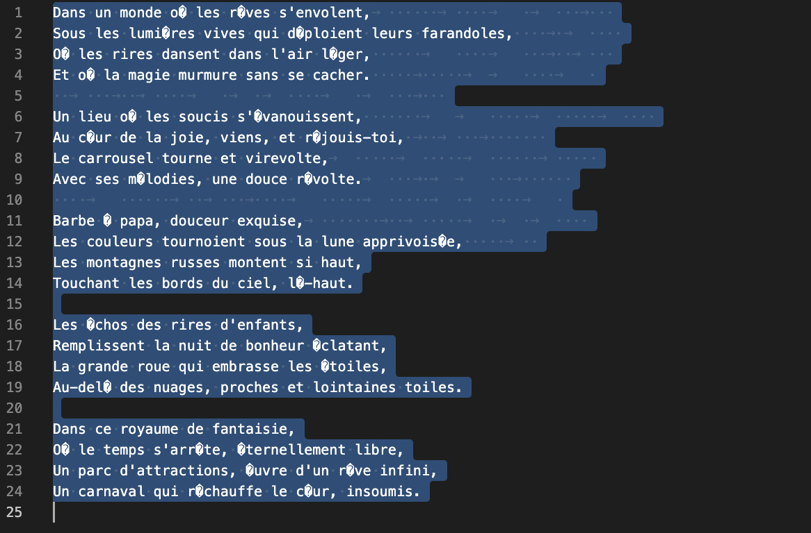
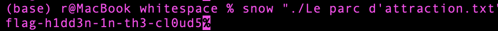
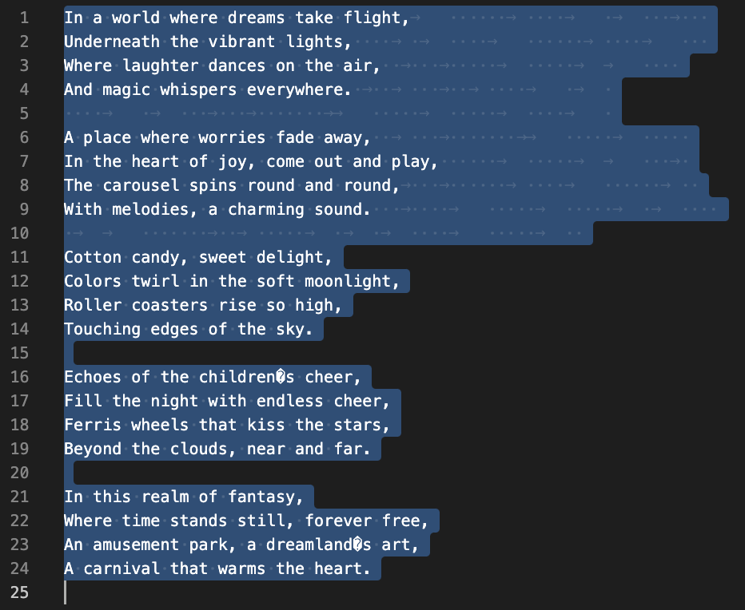
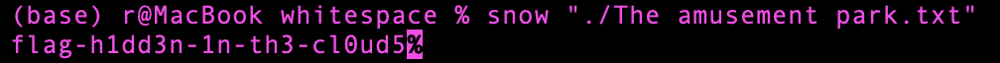

# Modern Art

**`Auteure:`** [euphoria](https://github.com/euphoria974)

## Solution (français)

En surlignant le texte, on peut remarquer des espaces et tabs à la fin des ligne.

Il suffit d'utiliser un logiciel (par exemple, [snow](https://darkside.com.au/snow/)) pour lire les données encodées dans les espaces. Les données ont été encodées sans mot de passe, donc elles peuvent être récupérées facilement.

## Solution (anglais)

When highlighting the text, we can see spaces and tabs at the end of the lines.

You only need to use a software (for example, [snow](https://darkside.com.au/snow/)) to read the encrypted data from the spaces. Since no password was used, the data can be decrypted easily.

