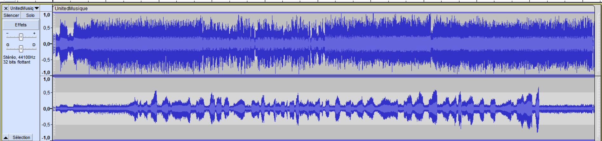

# United Musique
## Write-up
### Solution (Français)
Lorsqu'on écoute le fichier, on entends des vibrations sur le coté droit. On peut donc supposer que le message est caché dans le canal de droite. On peut donc utiliser Audacity pour isoler le canal de droite et écouter le message caché. Pour ce faire, on ouvre le fichier avec Audacity et on peut voir cela:

Si on extrait le son de droite, on remarque qu'on entends toujours le son original en plus du message caché. Si on applique quelques filtres pour réduire les aigues et augmenter les basses, on peut réduire le son original et entendre le message caché.
Si on l'accèlère assez, on remarque que le message sonne inversé. Si on l'inverse, on entends le message qui contient le flag.

flag: `flag-V3K7M5Y1Q9L8Z4P2C7T6W3R8F1K9J5B2`
### Solution (English)
When listening to the file, we can hear vibrations on the right side. We can assume that the message is hidden in the right channel. We can use Audacity to isolate the right channel and listen to the hidden message. To do this, we open the file with Audacity and we can see this:

If we extract the right sound, we notice that we still hear the original sound in addition to the hidden message. If we apply some filters to reduce the highs and increase the lows, we can reduce the original sound and hear the hidden message.
If we accelerate it enough, we notice that the message sounds reversed. If we reverse it, we hear the message that contains the flag.

flag: `flag-V3K7M5Y1Q9L8Z4P2C7T6W3R8F1K9J5B2`