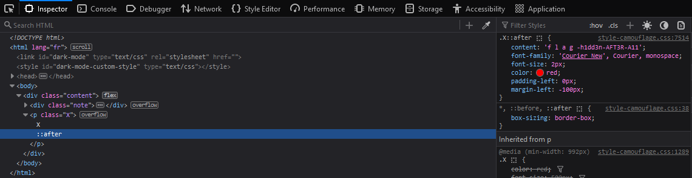

# Peinture

## Write-up (français)

Le défi parle de peinture, donc on peut déduire que le défi à un lien avec l'apparence du site web.
C'est le css qui permet de modifier l'apparence du site web.

Lorsqu'on regarde le code source de la page [`peinture`](../../src/templates/peinture.html) (clic droit `View Page Source`), on voit un [fichier css](../../src/static/css/style-peinture.css):
`<link rel="stylesheet" type="text/css" href="/static/css/style-peinture.css">`.

Il est possible de double cliquer sur le lien `/static/css/style-peinture.css` pour accéder au fichier.

On s'aperçoit que le fichier est énorme et contient le code css de Bootstrap v4.0.0.
Chercher un flag ici c'est compliqué.

Sur la page, on voit un gros ❌, ça pourrait être un indice à inspecter

Une manière d'inspecter le code c'est avec les DevTools:

1. Aller sur la page du défi [`peinture`](../../src/templates/peinture.html)
2. Ouvrir les DevTools en appuyant sur F12 ou clic droit `Inspect`
3. Sélectionner dans l'onglet en haut des DevTools `Inspector`
4. Ouvrir les balises html `body`, `div` et `p` pour voir le `X`
   1. On voit qu'il y a le sélecteur CSS `::after`
5. Cliquer sur le sélecteur CSS `::after`
6. Lire la valeur de la propriété CSS `content`
7. Enlever les espaces de `f l a g -`



## Write-up (english)

The challenge is about painting, so we can deduce that the challenge is related to the appearance of the website.
It is the css that allows you to modify the appearance of the website.

When we look at the source code of the page [`peinture`](../../src/templates/peinture.html) (right click `View Page Source`), we see a
`<link rel="stylesheet" type="text/css" href="/static/css/style-peinture.css">`.

It is possible to double click on the link `/static/css/style-peinture.css` to access the file.

We can see that the file is huge and contains Bootstrap v4.0.0 css code.
Finding a flag here is complicated.

On the page, we see a big ❌, it could be a clue to inspect

One way to inspect code is with DevTools:

1. Go to the challenge page [`peinture`](../../src/templates/peinture.html)
2. Open DevTools by pressing F12 or right click `Inspect`
3. Select in the tab at the top of the DevTools `Inspector`
4. Open the `body`, `div` and `p` html tags to see the `X`
    1. We see that there is the CSS selector `::after`
5. Click on the CSS `::after` selector
6. Read the value of the CSS `content` property
7. Remove spaces from `f l a g -`


## Flag

`flag-h1dd3n-AFT3R-A11`

## Code CSS sans Bootstrap

```css
@font-face {
    font-family: 'PirateWriting';
    src: url('../font/BattlesbridgeDemo-AL126.ttf');
}

body {
    background-image: url("https://i.pinimg.com/236x/84/21/70/842170d0c6dae05a7776d93009a8fbe5--old-wood-texture-texture-walls.jpg");
    font-family: 'PirateWriting';
}

.title {
    padding-top: 120px;
    width: 300px;
    padding-left: 70px;
}

.note {
    background-image: url("https://www.pngall.com/wp-content/uploads/2016/07/Scroll-PNG.png");
    width: 448px;
    height: 660px;
}

.content {
    display: flex;
    flex-direction: row;
    justify-content: center;
    align-items: center;
    text-align: center;
    min-height: 100vh;
}

.note p {
    width: 300px;
    padding-left: 70px;
    margin-bottom: 30px;
}

.X {
    color: red;
    font-size: 500px;
    font-weight: 900;
    font-family: 'Courier New', Courier, monospace;
    margin: 0;
    margin-left: 150px;
    margin-top: 450px;
}

.X::after {
    content: 'f l a g -h1dd3n-AFT3R-A11';
    font-family: 'Courier New', Courier, monospace;
    font-size: 2px;
    color: red;
    padding-left: 0px;
    margin-left: -100px;
}
```
