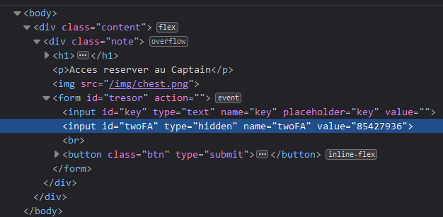

# Tresor 2

## Write-up (français)

Pour atteindre le flag, il faut écire la bonne clé dans le formulaire et contourne l'authentification à deux facteurs.

Lorsqu'on regarde le code source de la page [`tresor2`](../../src/templates/tresor2.html) (clic droit `View Page Source`), on voit un [fichier js](../../src/static/js/lvl2.js): `` et aussi un champs cacher dans le formulaire pour l'authentification à deux facteurs `<input type="hidden" id="twoFA" name="twoFA" value=""></input>`.

La clé est la même que pour [Tresor 1](../../tresor1/README.md) (`captain`).

Pour trouver le code de l'authentification à deux facteurs, il faut consulter le fichier [code.txt](../../src/static/captain/code.txt).
On pouvais savoir que le fichier existe en résolvant le défi [secret](../../secret/README.md) qui montre dans le fichier [robots.txt](../../src/static/robots.txt) le chemin du fichier [code.txt](../../src/static/captain/code.txt) `Disallow: /captain/code.txt`.
Le code est `85427936`.

En inspectant le champs caché pour le twoFA, on doit mettre la valeur du code dans le champs `value` :

## Write-up (english)

To reach the flag, you must enter the correct key in the form and bypass two-factor authentication.

When we look at the source code of the page [`tresor2`](../../src/templates/tresor2.html) (right click `View Page Source`), we see a [js file](../../src/static/js/lvl2.js): `` and also a hidden field in the form for two-factor authentication `<input type="hidden" id="twoFA" name="twoFA" value=""></input>`.

The key is the same as for [Tresor 1](../../tresor1/README.md) (`captain`).

To find the two-factor authentication code, you must consult the file [code.txt](../../src/static/captain/code.txt).
We could know that the file exists by solving the challenge [secret](../../secret/README.md) which shows in the file [robots.txt](../../src/static/robots.txt) the path to the file [code.txt](../../src/static/captain/code.txt) `Disallow: /captain/code.txt`.
The code is `85427936`.

When inspecting the hidden field for the twoFA, we must put the value of the code in the `value` field :

## Flag

`flag-S3CR3T-F0UND`
